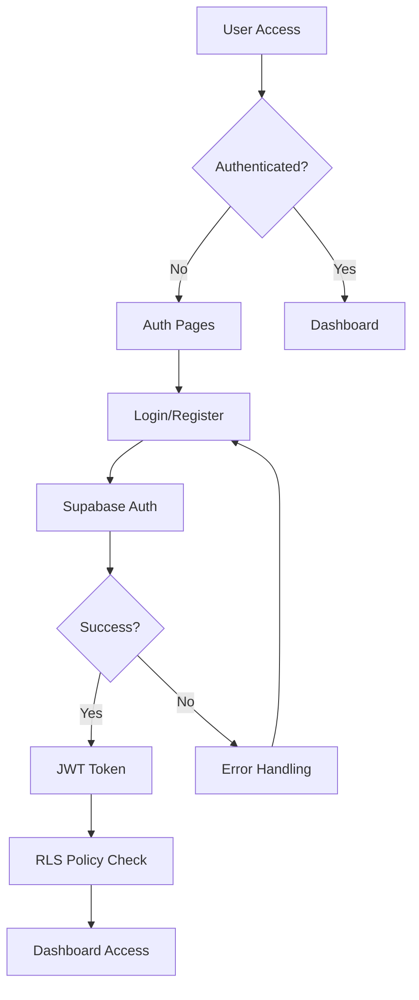

# Authentication - Developer Implementation Guide

## Technical Architecture Overview

### Technology Stack Integration
- **Frontend Framework:** Next.js 14 with App Router
- **Authentication Service:** Supabase Auth
- **Type Safety:** TypeScript with strict configuration
- **State Management:** React Server Components + Client Components
- **Form Handling:** React Hook Form with Zod validation
- **Styling:** Tailwind CSS with custom design tokens

### Authentication Flow Architecture


## Supabase Authentication Integration

### Project Configuration
```typescript
// lib/supabase/config.ts
import { createBrowserClient } from '@supabase/ssr'
import { Database } from './database.types'

export const createClient = () =>
  createBrowserClient<Database>(
    process.env.NEXT_PUBLIC_SUPABASE_URL!,
    process.env.NEXT_PUBLIC_SUPABASE_ANON_KEY!,
    {
      cookies: {
        get(name: string) {
          return getCookie(name)
        },
        set(name: string, value: string, options: CookieOptions) {
          setCookie(name, value, options)
        },
        remove(name: string, options: CookieOptions) {
          deleteCookie(name, options)
        }
      }
    }
  )

// Server-side client
export const createServerClient = () =>
  createServerClient<Database>(
    process.env.NEXT_PUBLIC_SUPABASE_URL!,
    process.env.NEXT_PUBLIC_SUPABASE_ANON_KEY!,
    {
      cookies: {
        get(name: string) {
          return cookies().get(name)?.value
        }
      }
    }
  )
```

### Environment Variables Setup
```bash
# .env.local
NEXT_PUBLIC_SUPABASE_URL=https://your-project.supabase.co
NEXT_PUBLIC_SUPABASE_ANON_KEY=your-anon-key
SUPABASE_SERVICE_ROLE_KEY=your-service-role-key

# OAuth Providers (optional)
NEXT_PUBLIC_GOOGLE_CLIENT_ID=your-google-client-id
NEXT_PUBLIC_FACEBOOK_APP_ID=your-facebook-app-id
```

## Component Implementation

### Authentication Provider
```typescript
// components/auth/auth-provider.tsx
'use client'

import { createContext, useContext, useEffect, useState } from 'react'
import { User, Session } from '@supabase/supabase-js'
import { createClient } from '@/lib/supabase/client'

interface AuthContextType {
  user: User | null
  session: Session | null
  loading: boolean
  signOut: () => Promise<void>
}

const AuthContext = createContext<AuthContextType>({
  user: null,
  session: null,
  loading: true,
  signOut: async () => {}
})

export const useAuth = () => {
  const context = useContext(AuthContext)
  if (!context) {
    throw new Error('useAuth must be used within AuthProvider')
  }
  return context
}

export function AuthProvider({ children }: { children: React.ReactNode }) {
  const [user, setUser] = useState<User | null>(null)
  const [session, setSession] = useState<Session | null>(null)
  const [loading, setLoading] = useState(true)
  const supabase = createClient()

  useEffect(() => {
    // Get initial session
    const getSession = async () => {
      const { data: { session }, error } = await supabase.auth.getSession()
      if (error) {
        console.error('Error getting session:', error)
      } else {
        setSession(session)
        setUser(session?.user ?? null)
      }
      setLoading(false)
    }

    getSession()

    // Listen for auth changes
    const { data: { subscription } } = supabase.auth.onAuthStateChange(
      async (event, session) => {
        setSession(session)
        setUser(session?.user ?? null)
        setLoading(false)
        
        // Handle auth state changes
        if (event === 'SIGNED_IN') {
          // Redirect to dashboard or intended page
          window.location.href = '/dashboard'
        } else if (event === 'SIGNED_OUT') {
          // Clear local state and redirect to login
          window.location.href = '/login'
        }
      }
    )

    return () => {
      subscription.unsubscribe()
    }
  }, [supabase])

  const signOut = async () => {
    const { error } = await supabase.auth.signOut()
    if (error) {
      console.error('Error signing out:', error)
    }
  }

  return (
    <AuthContext.Provider value={{ user, session, loading, signOut }}>
      {children}
    </AuthContext.Provider>
  )
}
```

### Login Form Component
```typescript
// components/auth/login-form.tsx
'use client'

import { useState } from 'react'
import { useForm } from 'react-hook-form'
import { zodResolver } from '@hookform/resolvers/zod'
import * as z from 'zod'
import { createClient } from '@/lib/supabase/client'
import { Button } from '@/components/ui/button'
import { Input } from '@/components/ui/input'
import { Alert, AlertDescription } from '@/components/ui/alert'
import { Loader2, Eye, EyeOff } from 'lucide-react'

const loginSchema = z.object({
  email: z
    .string()
    .min(1, 'Email is required')
    .email('Please enter a valid email address'),
  password: z
    .string()
    .min(1, 'Password is required')
    .min(8, 'Password must be at least 8 characters')
})

type LoginFormData = z.infer<typeof loginSchema>

export function LoginForm() {
  const [loading, setLoading] = useState(false)
  const [error, setError] = useState<string | null>(null)
  const [showPassword, setShowPassword] = useState(false)
  const supabase = createClient()

  const {
    register,
    handleSubmit,
    formState: { errors, isValid }
  } = useForm<LoginFormData>({
    resolver: zodResolver(loginSchema),
    mode: 'onBlur'
  })

  const onSubmit = async (data: LoginFormData) => {
    setLoading(true)
    setError(null)

    try {
      const { error } = await supabase.auth.signInWithPassword({
        email: data.email,
        password: data.password
      })

      if (error) {
        if (error.message.includes('Invalid login credentials')) {
          setError('Invalid email or password. Please check your credentials and try again.')
        } else {
          setError(error.message)
        }
      }
      // Success handling is done in AuthProvider via onAuthStateChange
    } catch (err) {
      setError('An unexpected error occurred. Please try again.')
    } finally {
      setLoading(false)
    }
  }

  const handleSocialLogin = async (provider: 'google' | 'facebook') => {
    setLoading(true)
    setError(null)

    try {
      const { error } = await supabase.auth.signInWithOAuth({
        provider,
        options: {
          redirectTo: `${window.location.origin}/auth/callback`
        }
      })

      if (error) {
        setError(`Error signing in with ${provider}: ${error.message}`)
      }
    } catch (err) {
      setError(`Failed to sign in with ${provider}. Please try again.`)
    } finally {
      setLoading(false)
    }
  }

  return (
    <div className="w-full max-w-md mx-auto">
      <div className="bg-white rounded-lg shadow-md p-8">
        <div className="mb-8 text-center">
          <h1 className="text-2xl font-semibold text-gray-900">
            Sign in to your account
          </h1>
          <p className="mt-2 text-sm text-gray-600">
            Access your rental management dashboard
          </p>
        </div>

        {error && (
          <Alert variant="destructive" className="mb-6">
            <AlertDescription>{error}</AlertDescription>
          </Alert>
        )}

        <form onSubmit={handleSubmit(onSubmit)} className="space-y-6">
          <div>
            <label
              htmlFor="email"
              className="block text-sm font-medium text-gray-700 mb-2"
            >
              Email address <span className="text-red-500">*</span>
            </label>
            <Input
              {...register('email')}
              type="email"
              id="email"
              autoComplete="email"
              className={errors.email ? 'border-red-500' : ''}
              placeholder="Enter your email address"
              disabled={loading}
              aria-invalid={errors.email ? 'true' : 'false'}
              aria-describedby={errors.email ? 'email-error' : undefined}
            />
            {errors.email && (
              <p id="email-error" className="mt-2 text-sm text-red-600" role="alert">
                {errors.email.message}
              </p>
            )}
          </div>

          <div>
            <label
              htmlFor="password"
              className="block text-sm font-medium text-gray-700 mb-2"
            >
              Password <span className="text-red-500">*</span>
            </label>
            <div className="relative">
              <Input
                {...register('password')}
                type={showPassword ? 'text' : 'password'}
                id="password"
                autoComplete="current-password"
                className={errors.password ? 'border-red-500 pr-10' : 'pr-10'}
                placeholder="Enter your password"
                disabled={loading}
                aria-invalid={errors.password ? 'true' : 'false'}
                aria-describedby={errors.password ? 'password-error' : undefined}
              />
              <button
                type="button"
                className="absolute inset-y-0 right-0 pr-3 flex items-center"
                onClick={() => setShowPassword(!showPassword)}
                disabled={loading}
                aria-label={showPassword ? 'Hide password' : 'Show password'}
              >
                {showPassword ? (
                  <EyeOff className="h-5 w-5 text-gray-400" aria-hidden="true" />
                ) : (
                  <Eye className="h-5 w-5 text-gray-400" aria-hidden="true" />
                )}
              </button>
            </div>
            {errors.password && (
              <p id="password-error" className="mt-2 text-sm text-red-600" role="alert">
                {errors.password.message}
              </p>
            )}
          </div>

          <div className="flex items-center justify-between">
            <div className="flex items-center">
              <input
                id="remember-me"
                name="remember-me"
                type="checkbox"
                className="h-4 w-4 text-blue-600 focus:ring-blue-500 border-gray-300 rounded"
              />
              <label htmlFor="remember-me" className="ml-2 block text-sm text-gray-700">
                Remember me
              </label>
            </div>

            <div className="text-sm">
              <a
                href="/forgot-password"
                className="font-medium text-blue-600 hover:text-blue-500 focus:outline-none focus:ring-2 focus:ring-blue-500 focus:ring-offset-2 rounded"
              >
                Forgot your password?
              </a>
            </div>
          </div>

          <Button
            type="submit"
            className="w-full"
            disabled={loading || !isValid}
            aria-describedby="signin-status"
          >
            {loading && <Loader2 className="mr-2 h-4 w-4 animate-spin" />}
            {loading ? 'Signing in...' : 'Sign In'}
          </Button>

          <div id="signin-status" aria-live="polite" aria-atomic="true" className="sr-only">
            {loading ? 'Signing in, please wait...' : ''}
          </div>
        </form>

        <div className="mt-6">
          <div className="relative">
            <div className="absolute inset-0 flex items-center">
              <div className="w-full border-t border-gray-300" />
            </div>
            <div className="relative flex justify-center text-sm">
              <span className="px-2 bg-white text-gray-500">Or continue with</span>
            </div>
          </div>

          <div className="mt-6 grid grid-cols-2 gap-3">
            <Button
              variant="outline"
              onClick={() => handleSocialLogin('google')}
              disabled={loading}
              className="w-full"
              aria-label="Sign in with Google"
            >
              <svg className="w-5 h-5 mr-2" viewBox="0 0 24 24" aria-hidden="true">
                {/* Google Logo SVG */}
                <path fill="#4285F4" d="M22.56 12.25c0-.78-.07-1.53-.2-2.25H12v4.26h5.92c-.26 1.37-1.04 2.53-2.21 3.31v2.77h3.57c2.08-1.92 3.28-4.74 3.28-8.09z"/>
                <path fill="#34A853" d="M12 23c2.97 0 5.46-.98 7.28-2.66l-3.57-2.77c-.98.66-2.23 1.06-3.71 1.06-2.86 0-5.29-1.93-6.16-4.53H2.18v2.84C3.99 20.53 7.7 23 12 23z"/>
                <path fill="#FBBC05" d="M5.84 14.09c-.22-.66-.35-1.36-.35-2.09s.13-1.43.35-2.09V7.07H2.18C1.43 8.55 1 10.22 1 12s.43 3.45 1.18 4.93l2.85-2.22.81-.62z"/>
                <path fill="#EA4335" d="M12 5.38c1.62 0 3.06.56 4.21 1.64l3.15-3.15C17.45 2.09 14.97 1 12 1 7.7 1 3.99 3.47 2.18 7.07l3.66 2.84c.87-2.6 3.3-4.53 6.16-4.53z"/>
              </svg>
              Google
            </Button>

            <Button
              variant="outline"
              onClick={() => handleSocialLogin('facebook')}
              disabled={loading}
              className="w-full"
              aria-label="Sign in with Facebook"
            >
              <svg className="w-5 h-5 mr-2" fill="#1877F2" viewBox="0 0 24 24" aria-hidden="true">
                <path d="M24 12.073c0-6.627-5.373-12-12-12s-12 5.373-12 12c0 5.99 4.388 10.954 10.125 11.854v-8.385H7.078v-3.47h3.047V9.43c0-3.007 1.792-4.669 4.533-4.669 1.312 0 2.686.235 2.686.235v2.953H15.83c-1.491 0-1.956.925-1.956 1.874v2.25h3.328l-.532 3.47h-2.796v8.385C19.612 23.027 24 18.062 24 12.073z"/>
              </svg>
              Facebook
            </Button>
          </div>
        </div>

        <p className="mt-8 text-center text-sm text-gray-600">
          Don't have an account?{' '}
          <a
            href="/register"
            className="font-medium text-blue-600 hover:text-blue-500 focus:outline-none focus:ring-2 focus:ring-blue-500 focus:ring-offset-2 rounded"
          >
            Create one now
          </a>
        </p>
      </div>
    </div>
  )
}
```

### Registration Form Component
```typescript
// components/auth/register-form.tsx
'use client'

import { useState } from 'react'
import { useForm } from 'react-hook-form'
import { zodResolver } from '@hookform/resolvers/zod'
import * as z from 'zod'
import { createClient } from '@/lib/supabase/client'
import { Button } from '@/components/ui/button'
import { Input } from '@/components/ui/input'
import { Alert, AlertDescription } from '@/components/ui/alert'
import { Checkbox } from '@/components/ui/checkbox'
import { Loader2, Eye, EyeOff, Check, X } from 'lucide-react'

const registerSchema = z.object({
  fullName: z
    .string()
    .min(1, 'Full name is required')
    .min(2, 'Full name must be at least 2 characters')
    .max(100, 'Full name must not exceed 100 characters'),
  email: z
    .string()
    .min(1, 'Email is required')
    .email('Please enter a valid email address'),
  password: z
    .string()
    .min(1, 'Password is required')
    .min(8, 'Password must be at least 8 characters')
    .regex(/[A-Z]/, 'Password must contain at least one uppercase letter')
    .regex(/[a-z]/, 'Password must contain at least one lowercase letter')
    .regex(/[0-9]/, 'Password must contain at least one number'),
  confirmPassword: z.string().min(1, 'Please confirm your password'),
  acceptTerms: z.boolean().refine(val => val === true, {
    message: 'You must accept the terms and conditions'
  })
}).refine((data) => data.password === data.confirmPassword, {
  message: 'Passwords do not match',
  path: ['confirmPassword']
})

type RegisterFormData = z.infer<typeof registerSchema>

interface PasswordRequirement {
  label: string
  test: (password: string) => boolean
}

const passwordRequirements: PasswordRequirement[] = [
  { label: 'At least 8 characters', test: (p) => p.length >= 8 },
  { label: 'One uppercase letter', test: (p) => /[A-Z]/.test(p) },
  { label: 'One lowercase letter', test: (p) => /[a-z]/.test(p) },
  { label: 'One number', test: (p) => /[0-9]/.test(p) }
]

export function RegisterForm() {
  const [loading, setLoading] = useState(false)
  const [error, setError] = useState<string | null>(null)
  const [success, setSuccess] = useState(false)
  const [showPassword, setShowPassword] = useState(false)
  const [showConfirmPassword, setShowConfirmPassword] = useState(false)
  const supabase = createClient()

  const {
    register,
    handleSubmit,
    watch,
    formState: { errors, isValid }
  } = useForm<RegisterFormData>({
    resolver: zodResolver(registerSchema),
    mode: 'onBlur'
  })

  const password = watch('password', '')

  const onSubmit = async (data: RegisterFormData) => {
    setLoading(true)
    setError(null)

    try {
      const { error } = await supabase.auth.signUp({
        email: data.email,
        password: data.password,
        options: {
          data: {
            full_name: data.fullName
          }
        }
      })

      if (error) {
        if (error.message.includes('already registered')) {
          setError('An account with this email already exists. Please sign in instead.')
        } else {
          setError(error.message)
        }
      } else {
        setSuccess(true)
      }
    } catch (err) {
      setError('An unexpected error occurred. Please try again.')
    } finally {
      setLoading(false)
    }
  }

  if (success) {
    return (
      <div className="w-full max-w-md mx-auto">
        <div className="bg-white rounded-lg shadow-md p-8 text-center">
          <div className="mx-auto flex items-center justify-center h-12 w-12 rounded-full bg-green-100 mb-4">
            <Check className="h-6 w-6 text-green-600" aria-hidden="true" />
          </div>
          
          <h1 className="text-2xl font-semibold text-gray-900 mb-4">
            Account created successfully!
          </h1>
          
          <div className="text-left bg-blue-50 rounded-lg p-4 mb-6">
            <h2 className="font-medium text-blue-900 mb-2">Next steps:</h2>
            <ol className="list-decimal list-inside space-y-1 text-sm text-blue-800">
              <li>Check your email for a verification link</li>
              <li>Click the link to verify your account</li>
              <li>Sign in to access your dashboard</li>
            </ol>
          </div>

          <div className="space-y-4">
            <Button asChild className="w-full">
              <a href="/login">Go to Sign In</a>
            </Button>
            
            <p className="text-sm text-gray-600">
              Didn't receive the email?{' '}
              <button
                type="button"
                className="font-medium text-blue-600 hover:text-blue-500 focus:outline-none focus:ring-2 focus:ring-blue-500 focus:ring-offset-2 rounded"
                onClick={() => {
                  // Implement resend verification email
                  console.log('Resend verification email')
                }}
              >
                Send it again
              </button>
            </p>
          </div>
        </div>
      </div>
    )
  }

  return (
    <div className="w-full max-w-md mx-auto">
      <div className="bg-white rounded-lg shadow-md p-8">
        <div className="mb-8 text-center">
          <h1 className="text-2xl font-semibold text-gray-900">
            Create your account
          </h1>
          <p className="mt-2 text-sm text-gray-600">
            Start managing your rental properties today
          </p>
        </div>

        {error && (
          <Alert variant="destructive" className="mb-6">
            <AlertDescription>{error}</AlertDescription>
          </Alert>
        )}

        <form onSubmit={handleSubmit(onSubmit)} className="space-y-6">
          <div>
            <label
              htmlFor="fullName"
              className="block text-sm font-medium text-gray-700 mb-2"
            >
              Full name <span className="text-red-500">*</span>
            </label>
            <Input
              {...register('fullName')}
              type="text"
              id="fullName"
              autoComplete="name"
              className={errors.fullName ? 'border-red-500' : ''}
              placeholder="Enter your full name"
              disabled={loading}
              aria-invalid={errors.fullName ? 'true' : 'false'}
              aria-describedby={errors.fullName ? 'fullName-error' : undefined}
            />
            {errors.fullName && (
              <p id="fullName-error" className="mt-2 text-sm text-red-600" role="alert">
                {errors.fullName.message}
              </p>
            )}
          </div>

          <div>
            <label
              htmlFor="email"
              className="block text-sm font-medium text-gray-700 mb-2"
            >
              Email address <span className="text-red-500">*</span>
            </label>
            <Input
              {...register('email')}
              type="email"
              id="email"
              autoComplete="email"
              className={errors.email ? 'border-red-500' : ''}
              placeholder="Enter your email address"
              disabled={loading}
              aria-invalid={errors.email ? 'true' : 'false'}
              aria-describedby={errors.email ? 'email-error' : undefined}
            />
            {errors.email && (
              <p id="email-error" className="mt-2 text-sm text-red-600" role="alert">
                {errors.email.message}
              </p>
            )}
          </div>

          <div>
            <label
              htmlFor="password"
              className="block text-sm font-medium text-gray-700 mb-2"
            >
              Password <span className="text-red-500">*</span>
            </label>
            <div className="relative">
              <Input
                {...register('password')}
                type={showPassword ? 'text' : 'password'}
                id="password"
                autoComplete="new-password"
                className={errors.password ? 'border-red-500 pr-10' : 'pr-10'}
                placeholder="Create a strong password"
                disabled={loading}
                aria-invalid={errors.password ? 'true' : 'false'}
                aria-describedby="password-requirements password-error"
              />
              <button
                type="button"
                className="absolute inset-y-0 right-0 pr-3 flex items-center"
                onClick={() => setShowPassword(!showPassword)}
                disabled={loading}
                aria-label={showPassword ? 'Hide password' : 'Show password'}
              >
                {showPassword ? (
                  <EyeOff className="h-5 w-5 text-gray-400" aria-hidden="true" />
                ) : (
                  <Eye className="h-5 w-5 text-gray-400" aria-hidden="true" />
                )}
              </button>
            </div>

            <div id="password-requirements" className="mt-2 text-sm">
              <p className="text-gray-600 mb-2">Password must contain:</p>
              <ul className="space-y-1">
                {passwordRequirements.map((requirement, index) => {
                  const isValid = requirement.test(password)
                  return (
                    <li key={index} className="flex items-center space-x-2">
                      {isValid ? (
                        <Check className="h-4 w-4 text-green-500" aria-hidden="true" />
                      ) : (
                        <X className="h-4 w-4 text-gray-400" aria-hidden="true" />
                      )}
                      <span className={isValid ? 'text-green-700' : 'text-gray-600'}>
                        {requirement.label}
                      </span>
                    </li>
                  )
                })}
              </ul>
            </div>

            {errors.password && (
              <p id="password-error" className="mt-2 text-sm text-red-600" role="alert">
                {errors.password.message}
              </p>
            )}
          </div>

          <div>
            <label
              htmlFor="confirmPassword"
              className="block text-sm font-medium text-gray-700 mb-2"
            >
              Confirm password <span className="text-red-500">*</span>
            </label>
            <div className="relative">
              <Input
                {...register('confirmPassword')}
                type={showConfirmPassword ? 'text' : 'password'}
                id="confirmPassword"
                autoComplete="new-password"
                className={errors.confirmPassword ? 'border-red-500 pr-10' : 'pr-10'}
                placeholder="Confirm your password"
                disabled={loading}
                aria-invalid={errors.confirmPassword ? 'true' : 'false'}
                aria-describedby={errors.confirmPassword ? 'confirmPassword-error' : undefined}
              />
              <button
                type="button"
                className="absolute inset-y-0 right-0 pr-3 flex items-center"
                onClick={() => setShowConfirmPassword(!showConfirmPassword)}
                disabled={loading}
                aria-label={showConfirmPassword ? 'Hide confirm password' : 'Show confirm password'}
              >
                {showConfirmPassword ? (
                  <EyeOff className="h-5 w-5 text-gray-400" aria-hidden="true" />
                ) : (
                  <Eye className="h-5 w-5 text-gray-400" aria-hidden="true" />
                )}
              </button>
            </div>
            {errors.confirmPassword && (
              <p id="confirmPassword-error" className="mt-2 text-sm text-red-600" role="alert">
                {errors.confirmPassword.message}
              </p>
            )}
          </div>

          <div className="flex items-start space-x-2">
            <Checkbox
              {...register('acceptTerms')}
              id="acceptTerms"
              disabled={loading}
              aria-invalid={errors.acceptTerms ? 'true' : 'false'}
              aria-describedby={errors.acceptTerms ? 'terms-error' : undefined}
            />
            <div className="text-sm leading-6">
              <label htmlFor="acceptTerms" className="text-gray-700">
                I accept the{' '}
                <a
                  href="/terms"
                  target="_blank"
                  rel="noopener noreferrer"
                  className="font-medium text-blue-600 hover:text-blue-500 focus:outline-none focus:ring-2 focus:ring-blue-500 focus:ring-offset-2 rounded"
                >
                  Terms and Conditions
                </a>{' '}
                and{' '}
                <a
                  href="/privacy"
                  target="_blank"
                  rel="noopener noreferrer"
                  className="font-medium text-blue-600 hover:text-blue-500 focus:outline-none focus:ring-2 focus:ring-blue-500 focus:ring-offset-2 rounded"
                >
                  Privacy Policy
                </a>
                <span className="text-red-500 ml-1">*</span>
              </label>
              {errors.acceptTerms && (
                <p id="terms-error" className="mt-1 text-red-600" role="alert">
                  {errors.acceptTerms.message}
                </p>
              )}
            </div>
          </div>

          <Button
            type="submit"
            className="w-full"
            disabled={loading || !isValid}
            aria-describedby="register-status"
          >
            {loading && <Loader2 className="mr-2 h-4 w-4 animate-spin" />}
            {loading ? 'Creating account...' : 'Create Account'}
          </Button>

          <div id="register-status" aria-live="polite" aria-atomic="true" className="sr-only">
            {loading ? 'Creating account, please wait...' : ''}
          </div>
        </form>

        <p className="mt-8 text-center text-sm text-gray-600">
          Already have an account?{' '}
          <a
            href="/login"
            className="font-medium text-blue-600 hover:text-blue-500 focus:outline-none focus:ring-2 focus:ring-blue-500 focus:ring-offset-2 rounded"
          >
            Sign in here
          </a>
        </p>
      </div>
    </div>
  )
}
```

## Route Handlers and Middleware

### Authentication Middleware
```typescript
// middleware.ts
import { createServerClient } from '@supabase/ssr'
import { NextResponse, type NextRequest } from 'next/server'

export async function middleware(request: NextRequest) {
  let response = NextResponse.next({
    request: {
      headers: request.headers,
    },
  })

  const supabase = createServerClient(
    process.env.NEXT_PUBLIC_SUPABASE_URL!,
    process.env.NEXT_PUBLIC_SUPABASE_ANON_KEY!,
    {
      cookies: {
        get(name: string) {
          return request.cookies.get(name)?.value
        },
        set(name: string, value: string, options: CookieOptions) {
          request.cookies.set({
            name,
            value,
            ...options,
          })
          response = NextResponse.next({
            request: {
              headers: request.headers,
            },
          })
          response.cookies.set({
            name,
            value,
            ...options,
          })
        },
        remove(name: string, options: CookieOptions) {
          request.cookies.set({
            name,
            value: '',
            ...options,
          })
          response = NextResponse.next({
            request: {
              headers: request.headers,
            },
          })
          response.cookies.set({
            name,
            value: '',
            ...options,
          })
        },
      },
    }
  )

  const {
    data: { user },
  } = await supabase.auth.getUser()

  const isAuthPage = request.nextUrl.pathname.startsWith('/auth') || 
                     request.nextUrl.pathname === '/login' ||
                     request.nextUrl.pathname === '/register'

  const isDashboardPage = request.nextUrl.pathname.startsWith('/dashboard')

  // Redirect authenticated users away from auth pages
  if (user && isAuthPage) {
    return NextResponse.redirect(new URL('/dashboard', request.url))
  }

  // Redirect unauthenticated users to login
  if (!user && isDashboardPage) {
    return NextResponse.redirect(new URL('/login', request.url))
  }

  return response
}

export const config = {
  matcher: [
    /*
     * Match all request paths except for the ones starting with:
     * - _next/static (static files)
     * - _next/image (image optimization files)
     * - favicon.ico (favicon file)
     */
    '/((?!_next/static|_next/image|favicon.ico|.*\\.(?:svg|png|jpg|jpeg|gif|webp)$).*)',
  ],
}
```

### OAuth Callback Handler
```typescript
// app/auth/callback/route.ts
import { createRouteHandlerClient } from '@supabase/auth-helpers-nextjs'
import { cookies } from 'next/headers'
import { NextRequest, NextResponse } from 'next/server'

export async function GET(request: NextRequest) {
  const requestUrl = new URL(request.url)
  const code = requestUrl.searchParams.get('code')

  if (code) {
    const supabase = createRouteHandlerClient({ cookies })
    
    try {
      const { error } = await supabase.auth.exchangeCodeForSession(code)
      
      if (error) {
        console.error('Error exchanging code for session:', error)
        return NextResponse.redirect(`${requestUrl.origin}/login?error=auth_error`)
      }
    } catch (error) {
      console.error('Error in OAuth callback:', error)
      return NextResponse.redirect(`${requestUrl.origin}/login?error=server_error`)
    }
  }

  // URL to redirect to after sign in process completes
  return NextResponse.redirect(`${requestUrl.origin}/dashboard`)
}
```

### Password Reset Handler
```typescript
// app/api/auth/reset-password/route.ts
import { createRouteHandlerClient } from '@supabase/auth-helpers-nextjs'
import { cookies } from 'next/headers'
import { NextRequest, NextResponse } from 'next/server'
import * as z from 'zod'

const resetSchema = z.object({
  email: z.string().email('Please enter a valid email address')
})

export async function POST(request: NextRequest) {
  try {
    const body = await request.json()
    const { email } = resetSchema.parse(body)

    const supabase = createRouteHandlerClient({ cookies })

    const { error } = await supabase.auth.resetPasswordForEmail(email, {
      redirectTo: `${process.env.NEXT_PUBLIC_SITE_URL}/reset-password`,
    })

    if (error) {
      return NextResponse.json(
        { error: error.message },
        { status: 400 }
      )
    }

    return NextResponse.json(
      { message: 'Password reset email sent successfully' },
      { status: 200 }
    )
  } catch (error) {
    if (error instanceof z.ZodError) {
      return NextResponse.json(
        { error: error.errors[0].message },
        { status: 400 }
      )
    }

    return NextResponse.json(
      { error: 'Internal server error' },
      { status: 500 }
    )
  }
}
```

## Database Setup and Row Level Security

### User Profile Table
```sql
-- Create profiles table that extends auth.users
CREATE TABLE profiles (
  id UUID PRIMARY KEY REFERENCES auth.users(id) ON DELETE CASCADE,
  full_name TEXT NOT NULL,
  avatar_url TEXT,
  phone TEXT,
  timezone TEXT DEFAULT 'UTC',
  role TEXT DEFAULT 'owner' CHECK (role IN ('owner', 'cleaner', 'admin')),
  settings JSONB DEFAULT '{}',
  created_at TIMESTAMPTZ DEFAULT NOW(),
  updated_at TIMESTAMPTZ DEFAULT NOW()
);

-- Enable RLS
ALTER TABLE profiles ENABLE ROW LEVEL SECURITY;

-- RLS Policies
CREATE POLICY "Users can view own profile" ON profiles
  FOR SELECT USING (auth.uid() = id);

CREATE POLICY "Users can update own profile" ON profiles
  FOR UPDATE USING (auth.uid() = id);

-- Function to handle new user registration
CREATE OR REPLACE FUNCTION public.handle_new_user()
RETURNS TRIGGER AS $$
BEGIN
  INSERT INTO public.profiles (id, full_name, avatar_url)
  VALUES (
    NEW.id,
    NEW.raw_user_meta_data->>'full_name',
    NEW.raw_user_meta_data->>'avatar_url'
  );
  RETURN NEW;
END;
$$ LANGUAGE plpgsql SECURITY DEFINER;

-- Trigger for new user creation
CREATE TRIGGER on_auth_user_created
  AFTER INSERT ON auth.users
  FOR EACH ROW EXECUTE FUNCTION public.handle_new_user();

-- Function to update updated_at timestamp
CREATE OR REPLACE FUNCTION update_updated_at_column()
RETURNS TRIGGER AS $$
BEGIN
  NEW.updated_at = NOW();
  RETURN NEW;
END;
$$ LANGUAGE plpgsql;

-- Trigger to update updated_at automatically
CREATE TRIGGER update_profiles_updated_at
  BEFORE UPDATE ON profiles
  FOR EACH ROW EXECUTE FUNCTION update_updated_at_column();
```

## Testing Implementation

### Unit Tests for Authentication Components
```typescript
// __tests__/components/auth/login-form.test.tsx
import { render, screen, fireEvent, waitFor } from '@testing-library/react'
import userEvent from '@testing-library/user-event'
import { LoginForm } from '@/components/auth/login-form'
import { createClient } from '@/lib/supabase/client'

// Mock Supabase client
jest.mock('@/lib/supabase/client', () => ({
  createClient: jest.fn()
}))

const mockSupabase = {
  auth: {
    signInWithPassword: jest.fn(),
    signInWithOAuth: jest.fn()
  }
}

beforeEach(() => {
  (createClient as jest.Mock).mockReturnValue(mockSupabase)
})

describe('LoginForm', () => {
  test('renders login form with all required elements', () => {
    render(<LoginForm />)
    
    expect(screen.getByRole('heading', { name: /sign in to your account/i })).toBeInTheDocument()
    expect(screen.getByLabelText(/email address/i)).toBeInTheDocument()
    expect(screen.getByLabelText(/^password/i)).toBeInTheDocument()
    expect(screen.getByRole('button', { name: /sign in/i })).toBeInTheDocument()
    expect(screen.getByRole('button', { name: /continue with google/i })).toBeInTheDocument()
    expect(screen.getByRole('button', { name: /continue with facebook/i })).toBeInTheDocument()
  })

  test('validates email field on blur', async () => {
    const user = userEvent.setup()
    render(<LoginForm />)
    
    const emailInput = screen.getByLabelText(/email address/i)
    
    await user.type(emailInput, 'invalid-email')
    await user.tab()
    
    expect(await screen.findByText(/please enter a valid email address/i)).toBeInTheDocument()
  })

  test('validates password field on blur', async () => {
    const user = userEvent.setup()
    render(<LoginForm />)
    
    const passwordInput = screen.getByLabelText(/^password/i)
    
    await user.type(passwordInput, '123')
    await user.tab()
    
    expect(await screen.findByText(/password must be at least 8 characters/i)).toBeInTheDocument()
  })

  test('submits form with valid credentials', async () => {
    const user = userEvent.setup()
    mockSupabase.auth.signInWithPassword.mockResolvedValue({ error: null })
    
    render(<LoginForm />)
    
    await user.type(screen.getByLabelText(/email address/i), 'test@example.com')
    await user.type(screen.getByLabelText(/^password/i), 'validpassword123')
    await user.click(screen.getByRole('button', { name: /sign in/i }))
    
    await waitFor(() => {
      expect(mockSupabase.auth.signInWithPassword).toHaveBeenCalledWith({
        email: 'test@example.com',
        password: 'validpassword123'
      })
    })
  })

  test('shows error message for invalid credentials', async () => {
    const user = userEvent.setup()
    mockSupabase.auth.signInWithPassword.mockResolvedValue({
      error: { message: 'Invalid login credentials' }
    })
    
    render(<LoginForm />)
    
    await user.type(screen.getByLabelText(/email address/i), 'test@example.com')
    await user.type(screen.getByLabelText(/^password/i), 'wrongpassword')
    await user.click(screen.getByRole('button', { name: /sign in/i }))
    
    expect(await screen.findByText(/invalid email or password/i)).toBeInTheDocument()
  })

  test('toggles password visibility', async () => {
    const user = userEvent.setup()
    render(<LoginForm />)
    
    const passwordInput = screen.getByLabelText(/^password/i) as HTMLInputElement
    const toggleButton = screen.getByRole('button', { name: /show password/i })
    
    expect(passwordInput.type).toBe('password')
    
    await user.click(toggleButton)
    
    expect(passwordInput.type).toBe('text')
    expect(screen.getByRole('button', { name: /hide password/i })).toBeInTheDocument()
  })

  test('handles social login', async () => {
    const user = userEvent.setup()
    mockSupabase.auth.signInWithOAuth.mockResolvedValue({ error: null })
    
    render(<LoginForm />)
    
    await user.click(screen.getByRole('button', { name: /continue with google/i }))
    
    await waitFor(() => {
      expect(mockSupabase.auth.signInWithOAuth).toHaveBeenCalledWith({
        provider: 'google',
        options: {
          redirectTo: expect.stringContaining('/auth/callback')
        }
      })
    })
  })

  test('is accessible with keyboard navigation', async () => {
    const user = userEvent.setup()
    render(<LoginForm />)
    
    // Tab through form elements
    await user.tab()
    expect(screen.getByLabelText(/email address/i)).toHaveFocus()
    
    await user.tab()
    expect(screen.getByLabelText(/^password/i)).toHaveFocus()
    
    await user.tab()
    expect(screen.getByRole('button', { name: /show password/i })).toHaveFocus()
    
    await user.tab()
    expect(screen.getByRole('button', { name: /sign in/i })).toHaveFocus()
  })
})
```

### Integration Tests
```typescript
// __tests__/integration/auth-flow.test.tsx
import { render, screen, waitFor } from '@testing-library/react'
import userEvent from '@testing-library/user-event'
import { AuthProvider } from '@/components/auth/auth-provider'
import { LoginForm } from '@/components/auth/login-form'

describe('Authentication Flow Integration', () => {
  test('complete login flow works correctly', async () => {
    const user = userEvent.setup()
    
    render(
      <AuthProvider>
        <LoginForm />
      </AuthProvider>
    )
    
    // Fill in and submit login form
    await user.type(screen.getByLabelText(/email address/i), 'test@example.com')
    await user.type(screen.getByLabelText(/^password/i), 'testpassword123')
    await user.click(screen.getByRole('button', { name: /sign in/i }))
    
    // Verify loading state
    expect(screen.getByText(/signing in/i)).toBeInTheDocument()
    
    // Wait for authentication to complete
    await waitFor(
      () => {
        expect(window.location.href).toBe('/dashboard')
      },
      { timeout: 5000 }
    )
  })
})
```

## Performance Optimization

### Code Splitting and Lazy Loading
```typescript
// Dynamic imports for auth forms
import dynamic from 'next/dynamic'

const LoginForm = dynamic(() => import('@/components/auth/login-form'), {
  loading: () => <AuthFormSkeleton />
})

const RegisterForm = dynamic(() => import('@/components/auth/register-form'), {
  loading: () => <AuthFormSkeleton />
})

// Skeleton component for loading state
function AuthFormSkeleton() {
  return (
    <div className="w-full max-w-md mx-auto">
      <div className="bg-white rounded-lg shadow-md p-8">
        <div className="animate-pulse space-y-6">
          <div className="h-8 bg-gray-200 rounded w-3/4 mx-auto"></div>
          <div className="space-y-4">
            <div className="h-12 bg-gray-200 rounded"></div>
            <div className="h-12 bg-gray-200 rounded"></div>
            <div className="h-12 bg-blue-200 rounded"></div>
          </div>
        </div>
      </div>
    </div>
  )
}
```

### Bundle Optimization
```javascript
// next.config.js
/** @type {import('next').NextConfig} */
const nextConfig = {
  experimental: {
    optimizeCss: true,
    optimizePackageImports: ['lucide-react', '@supabase/supabase-js']
  },
  
  // Compress images automatically
  images: {
    formats: ['image/webp', 'image/avif'],
    minimumCacheTTL: 60,
  },

  // Enable build-time optimizations
  swcMinify: true,
  
  // Remove console.logs in production
  compiler: {
    removeConsole: process.env.NODE_ENV === 'production'
  }
}

module.exports = nextConfig
```

## Monitoring and Analytics

### Error Tracking
```typescript
// lib/error-tracking.ts
interface AuthError {
  type: 'login_failed' | 'registration_failed' | 'oauth_failed' | 'session_expired'
  message: string
  userAgent?: string
  timestamp: Date
}

export function trackAuthError(error: AuthError) {
  // Send to your analytics service
  if (typeof window !== 'undefined') {
    // Client-side tracking
    console.error('Auth Error:', error)
    
    // Example: Send to analytics service
    // analytics.track('Authentication Error', error)
  }
}

// Usage in components
const handleLoginError = (error: AuthError) => {
  trackAuthError({
    type: 'login_failed',
    message: error.message,
    userAgent: navigator.userAgent,
    timestamp: new Date()
  })
}
```

### Success Metrics Tracking
```typescript
// lib/auth-analytics.ts
export function trackAuthSuccess(event: 'login' | 'registration' | 'social_login') {
  if (typeof window !== 'undefined') {
    // Track successful authentication events
    // analytics.track(`Authentication ${event}`, {
    //   timestamp: new Date(),
    //   userAgent: navigator.userAgent
    // })
  }
}
```

## Security Best Practices

### Input Sanitization
```typescript
// lib/sanitization.ts
import DOMPurify from 'isomorphic-dompurify'

export function sanitizeInput(input: string): string {
  return DOMPurify.sanitize(input.trim())
}

export function validateEmail(email: string): boolean {
  const emailRegex = /^[^\s@]+@[^\s@]+\.[^\s@]+$/
  return emailRegex.test(email) && email.length <= 254
}
```

### Rate Limiting
```typescript
// lib/rate-limiting.ts
interface RateLimitConfig {
  maxAttempts: number
  windowMs: number
  blockDurationMs: number
}

class ClientSideRateLimit {
  private attempts: Map<string, number[]> = new Map()

  isAllowed(key: string, config: RateLimitConfig): boolean {
    const now = Date.now()
    const attempts = this.attempts.get(key) || []
    
    // Remove expired attempts
    const validAttempts = attempts.filter(
      attempt => now - attempt < config.windowMs
    )
    
    if (validAttempts.length >= config.maxAttempts) {
      return false
    }
    
    validAttempts.push(now)
    this.attempts.set(key, validAttempts)
    return true
  }
}

export const authRateLimit = new ClientSideRateLimit()
```

## Deployment and Environment Setup

### Environment Configuration
```bash
# .env.example
# Supabase Configuration
NEXT_PUBLIC_SUPABASE_URL=https://your-project.supabase.co
NEXT_PUBLIC_SUPABASE_ANON_KEY=your-anon-key
SUPABASE_SERVICE_ROLE_KEY=your-service-role-key

# OAuth Providers
NEXT_PUBLIC_GOOGLE_CLIENT_ID=your-google-client-id
NEXT_PUBLIC_FACEBOOK_APP_ID=your-facebook-app-id

# Application URLs
NEXT_PUBLIC_SITE_URL=https://your-domain.com

# Optional: Analytics
NEXT_PUBLIC_GOOGLE_ANALYTICS_ID=your-ga-id
```

### Vercel Deployment Configuration
```json
{
  "name": "vrbnbxoss",
  "version": 2,
  "builds": [
    {
      "src": "package.json",
      "use": "@vercel/next"
    }
  ],
  "env": {
    "NEXT_PUBLIC_SUPABASE_URL": "@supabase_url",
    "NEXT_PUBLIC_SUPABASE_ANON_KEY": "@supabase_anon_key",
    "SUPABASE_SERVICE_ROLE_KEY": "@supabase_service_role_key"
  },
  "regions": ["iad1"],
  "functions": {
    "app/api/**/*.ts": {
      "maxDuration": 30
    }
  }
}
```

## Quality Assurance Checklist

### Functional Testing
- [ ] Email/password registration creates user account
- [ ] Email verification sends and processes correctly
- [ ] Login with valid credentials succeeds
- [ ] Login with invalid credentials fails appropriately
- [ ] Social login (Google/Facebook) works correctly
- [ ] Password reset sends email and updates password
- [ ] Form validation shows appropriate error messages
- [ ] Success states provide clear feedback and next steps
- [ ] Session management persists across page refreshes
- [ ] Multi-device session sync works correctly
- [ ] Logout clears session and redirects appropriately

### Performance Testing
- [ ] Initial page load under 2 seconds
- [ ] Form validation feedback under 200ms
- [ ] Authentication request completes under 3 seconds
- [ ] Social OAuth redirect completes under 5 seconds
- [ ] Bundle size optimized and code split appropriately
- [ ] Images optimized for web delivery

### Security Testing
- [ ] Input sanitization prevents XSS attacks
- [ ] SQL injection protection in place
- [ ] Rate limiting prevents brute force attacks
- [ ] CSRF protection implemented
- [ ] Secure headers configured
- [ ] HTTPS enforcement in production

### Accessibility Testing
- [ ] Screen reader compatibility verified
- [ ] Keyboard navigation works completely
- [ ] Focus indicators clearly visible
- [ ] Color contrast meets WCAG AA standards
- [ ] Touch targets meet size requirements
- [ ] Error announcements work correctly

## Related Documentation

- [Feature Overview](./README.md) - High-level feature summary
- [User Journey Analysis](./user-journey.md) - Complete user experience mapping
- [Screen States Specifications](./screen-states.md) - Visual design specifications
- [Interaction Patterns](./interactions.md) - Animation and feedback specifications
- [Accessibility Requirements](./accessibility.md) - Inclusive design specifications
- [Design System Components](../../design-system/components/) - Component specifications