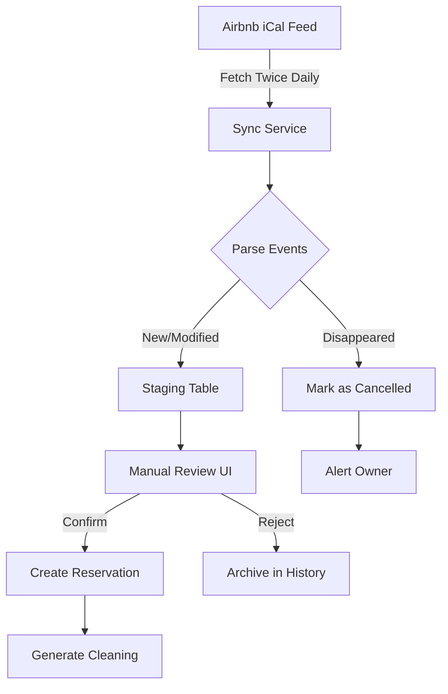

# Airbnb iCal Integration Strategy for VRBNBXOSS

> **Document Version**: 2.0  
> **Last Updated**: September 2025  
> **Status**: Implementation Ready

## Table of Contents
1. [Executive Summary](#executive-summary)
2. [Current State Analysis](#current-state-analysis)
3. [iCal Sync Workflow](#ical-sync-workflow)
4. [Smart History Storage System](#smart-history-storage-system)
5. [Cancellation Detection System](#cancellation-detection-system)
6. [Database Architecture](#database-architecture)
7. [Implementation Roadmap](#implementation-roadmap)
8. [Risk Mitigation Strategies](#risk-mitigation-strategies)
9. [Monitoring Dashboard](#monitoring-dashboard)

---

## Executive Summary

This document outlines the strategy for integrating Airbnb's iCal feed into VRBNBXOSS, addressing the challenges of limited data availability and implementing smart delta-based history tracking with twice-daily synchronization.

### Key Challenges
- **No Official API**: Airbnb API restricted to select partners only
- **Limited iCal Data**: No guest details, pricing, or contact information
- **Sync Frequency**: Limited to twice daily to minimize load
- **Silent Cancellations**: Cancelled reservations simply disappear without notification

### Proposed Solution
iCal synchronization with staging tables, manual confirmation workflows, and intelligent delta-based history tracking that only stores changes to minimize storage while maintaining full audit capability.

---

## Current State Analysis

### Airbnb iCal Structure
Based on analysis of actual Airbnb iCal feed (`listing-35252063.ics`):

```icalendar
BEGIN:VEVENT
DTSTART;VALUE=DATE:20250902
DTEND;VALUE=DATE:20250905
SUMMARY:Reserved
UID:1418fb94e984-e0b474976057a1394fcbc9fb8909f26f@airbnb.com
DESCRIPTION:Reservation URL: https://www.airbnb.com/hosting/reservations/details/HM25Z3NPQA
Phone Number (Last 4 Digits): 1207
END:VEVENT
```

### Available Data Points
- **UID**: Unique identifier (stable across syncs)
- **Dates**: Check-in/Check-out (DATE format only, no times)
- **Status**: "Reserved" or "Airbnb (Not available)"
- **URL**: Deep link to reservation (contains reservation ID)
- **Phone**: Last 4 digits only (privacy protection)

### Missing Critical Data
- Guest name and full contact details
- Pricing information (total, cleaning fee, platform fee)
- Guest count
- Special requests or notes
- Modification history

---

## iCal Sync Workflow

### Architecture Overview



### Sync Schedule
- **Morning Sync**: 9:00 AM
- **Evening Sync**: 9:00 PM
- **Manual Sync**: Available on-demand via dashboard

### Detailed Process Flow

#### 1. Initial Import Stage
```typescript
interface StagedReservation {
  id: string;                    // Our internal UUID
  sync_source: 'airbnb_ical';    
  sync_uid: string;               // Airbnb UID
  platform_id: string;            // Extracted from URL (HM25Z3NPQA)
  raw_data: JsonB;                // Complete iCal VEVENT
  
  // Parsed fields
  check_in: Date;
  check_out: Date;
  status_text: string;            // "Reserved" or "Not available"
  phone_last_four?: string;
  
  // Workflow fields
  stage_status: 'pending' | 'confirmed' | 'rejected' | 'cancelled';
  reviewed_at?: Date;
  reviewed_by?: string;
  
  // History tracking
  first_seen_at: Date;
  last_seen_at: Date;
  disappeared_at?: Date;
  
  created_at: Date;
  updated_at: Date;
}
```

#### 2. Confirmation Workflow

**Automatic Pre-validation:**
- Check for date conflicts with existing reservations
- Verify apartment capacity constraints
- Detect potential duplicates (same dates, same apartment)

**Manual Review Interface:**
```
┌─────────────────────────────────────────────┐
│ New Airbnb Reservation Detected            │
├─────────────────────────────────────────────┤
│ Apartment: Le Boccador                     │
│ Check-in:  2025-09-02                      │
│ Check-out: 2025-09-05                      │
│ Nights: 3                                  │
│ Phone (last 4): 1207                       │
│                                            │
│ ⚠️ Missing Information:                    │
│ - Guest name                               │
│ - Guest count                              │
│ - Total price                              │
│                                            │
│ [View on Airbnb] [Add Guest Info]          │
│                                            │
│ [✓ Confirm] [✗ Reject] [⏱ Later]          │
└─────────────────────────────────────────────┘
```

#### 3. Data Enrichment Flow
After confirmation, owner can:
1. Click "View on Airbnb" → Copy guest details manually
2. Fill in missing information (guest name, count, pricing)
3. System creates proper reservation with complete data

---

## Smart History Storage System

### Delta-Based Architecture

Instead of storing complete snapshots every sync, we implement a smart delta system:

```sql
-- Store only changes, not full copies
CREATE TABLE sync_deltas (
  id UUID PRIMARY KEY DEFAULT gen_random_uuid(),
  apartment_id UUID NOT NULL,
  sync_timestamp TIMESTAMPTZ NOT NULL,
  
  -- Delta tracking
  events_added JSONB,      -- New events that appeared
  events_removed JSONB,    -- Events that disappeared
  events_modified JSONB,   -- Events with changed data
  
  -- Summary
  total_added INTEGER DEFAULT 0,
  total_removed INTEGER DEFAULT 0,
  total_modified INTEGER DEFAULT 0,
  
  -- Optimization
  checksum VARCHAR(64),    -- Hash of current state
  has_changes BOOLEAN DEFAULT false,
  
  created_at TIMESTAMPTZ DEFAULT NOW()
);

-- Checksum table for quick change detection
CREATE TABLE sync_checksums (
  apartment_id UUID PRIMARY KEY,
  current_checksum VARCHAR(64) NOT NULL,
  last_sync TIMESTAMPTZ NOT NULL,
  events_count INTEGER DEFAULT 0,
  updated_at TIMESTAMPTZ DEFAULT NOW()
);

-- Compact history log for unchanged syncs
CREATE TABLE sync_log (
  id UUID PRIMARY KEY DEFAULT gen_random_uuid(),
  apartment_id UUID NOT NULL,
  sync_timestamp TIMESTAMPTZ NOT NULL,
  status VARCHAR(50) NOT NULL, -- 'no_changes', 'changes_detected', 'error'
  message TEXT,
  created_at TIMESTAMPTZ DEFAULT NOW()
);
```

### Delta Detection Algorithm

```typescript
class SmartHistoryTracker {
  async syncAndTrackDeltas(apartmentId: string, currentEvents: ParsedEvent[]) {
    // Calculate checksum of current state
    const currentChecksum = this.calculateChecksum(currentEvents);
    
    // Get previous checksum
    const previousChecksum = await this.getPreviousChecksum(apartmentId);
    
    // Quick check: if checksums match, nothing changed
    if (currentChecksum === previousChecksum) {
      // Just log a simple entry - no data storage needed
      await this.logSync(apartmentId, 'no_changes', 'State unchanged');
      return { hasChanges: false };
    }
    
    // Something changed - calculate deltas
    const previousEvents = await this.getPreviousEvents(apartmentId);
    const deltas = this.calculateDeltas(currentEvents, previousEvents);
    
    // Store only the changes
    await this.storeDelta({
      apartment_id: apartmentId,
      sync_timestamp: new Date(),
      events_added: deltas.added.length > 0 ? deltas.added : null,
      events_removed: deltas.removed.length > 0 ? deltas.removed : null,
      events_modified: deltas.modified.length > 0 ? deltas.modified : null,
      total_added: deltas.added.length,
      total_removed: deltas.removed.length,
      total_modified: deltas.modified.length,
      checksum: currentChecksum,
      has_changes: true
    });
    
    // Update current checksum
    await this.updateChecksum(apartmentId, currentChecksum);
    
    return { hasChanges: true, deltas };
  }
  
  private calculateChecksum(events: ParsedEvent[]): string {
    // Sort events by UID for consistent ordering
    const sorted = events.sort((a, b) => a.uid.localeCompare(b.uid));
    const content = sorted.map(e => `${e.uid}:${e.checkIn}:${e.checkOut}:${e.summary}`).join('|');
    return crypto.createHash('sha256').update(content).digest('hex');
  }
  
  private calculateDeltas(current: ParsedEvent[], previous: ParsedEvent[]) {
    const currentMap = new Map(current.map(e => [e.uid, e]));
    const previousMap = new Map(previous.map(e => [e.uid, e]));
    
    const added = current.filter(e => !previousMap.has(e.uid));
    const removed = previous.filter(e => !currentMap.has(e.uid));
    
    const modified = [];
    for (const [uid, currentEvent] of currentMap) {
      const previousEvent = previousMap.get(uid);
      if (previousEvent && this.hasChanged(currentEvent, previousEvent)) {
        modified.push({
          uid,
          before: previousEvent,
          after: currentEvent,
          changes: this.getChanges(currentEvent, previousEvent)
        });
      }
    }
    
    return { added, removed, modified };
  }
}
```

### Storage Optimization

```typescript
// Reconstruct full state from deltas when needed
async function reconstructStateAtTime(apartmentId: string, timestamp: Date) {
  // Find the nearest full snapshot (if we keep periodic snapshots)
  const baseSnapshot = await getBaseSnapshot(apartmentId, timestamp);
  
  // Apply all deltas since that snapshot
  const deltas = await getDeltas(apartmentId, baseSnapshot.timestamp, timestamp);
  
  let state = baseSnapshot.events;
  for (const delta of deltas) {
    // Remove disappeared events
    if (delta.events_removed) {
      state = state.filter(e => !delta.events_removed.find(r => r.uid === e.uid));
    }
    
    // Add new events
    if (delta.events_added) {
      state.push(...delta.events_added);
    }
    
    // Apply modifications
    if (delta.events_modified) {
      for (const mod of delta.events_modified) {
        const index = state.findIndex(e => e.uid === mod.uid);
        if (index >= 0) {
          state[index] = mod.after;
        }
      }
    }
  }
  
  return state;
}
```

---

## Cancellation Detection System

### The Challenge
iCal doesn't send cancellation events - reservations simply disappear from the feed.

### Detection Algorithm

```typescript
async function detectCancellations(
  currentUIDs: string[], 
  previousUIDs: string[]
): Promise<string[]> {
  const disappeared = previousUIDs.filter(
    uid => !currentUIDs.includes(uid)
  );
  
  for (const uid of disappeared) {
    // Mark as potentially cancelled
    await markEventDisappeared(uid);
    
    // Check if it had a confirmed reservation
    const reservation = await findReservationByUID(uid);
    if (reservation && reservation.status === 'confirmed') {
      // Trigger cancellation alert
      await createCancellationAlert(reservation);
      
      // Don't auto-cancel - require manual confirmation
      // (Could be a date modification, not cancellation)
    }
  }
  
  return disappeared;
}
```

### Alert System
When cancellation detected:
1. **Immediate Email Alert** to property owner
2. **Dashboard Notification** with action required
3. **Soft Cancel** - Mark as potentially cancelled, await confirmation
4. **History Preservation** - Never delete, maintain full audit trail

---

## Database Architecture

### New Tables Required

#### 1. Staging Table
```sql
CREATE TABLE reservation_staging (
  id UUID PRIMARY KEY DEFAULT gen_random_uuid(),
  apartment_id UUID NOT NULL REFERENCES apartments(id),
  platform platform_type NOT NULL,
  
  -- Sync metadata
  sync_source VARCHAR(50) NOT NULL,
  sync_uid TEXT UNIQUE,
  sync_url TEXT,
  raw_data JSONB NOT NULL,
  
  -- Parsed fields
  check_in DATE NOT NULL,
  check_out DATE NOT NULL,
  status_text VARCHAR(100),
  guest_hint VARCHAR(255),
  
  -- Workflow
  stage_status staging_status DEFAULT 'pending',
  stage_notes TEXT,
  reviewed_by UUID REFERENCES profiles(id),
  reviewed_at TIMESTAMPTZ,
  
  -- Resulting reservation
  reservation_id UUID REFERENCES reservations(id),
  
  -- Timestamps
  first_seen_at TIMESTAMPTZ DEFAULT NOW(),
  last_seen_at TIMESTAMPTZ DEFAULT NOW(),
  created_at TIMESTAMPTZ DEFAULT NOW(),
  updated_at TIMESTAMPTZ DEFAULT NOW()
);
```

#### 2. Alert Queue Table
```sql
CREATE TABLE sync_alerts (
  id UUID PRIMARY KEY DEFAULT gen_random_uuid(),
  alert_type VARCHAR(50) NOT NULL,
  severity VARCHAR(20) DEFAULT 'info',
  
  -- Context
  apartment_id UUID,
  reservation_id UUID,
  staging_id UUID,
  
  -- Content
  title TEXT NOT NULL,
  message TEXT NOT NULL,
  action_url TEXT,
  
  -- Status
  is_read BOOLEAN DEFAULT FALSE,
  read_at TIMESTAMPTZ,
  is_resolved BOOLEAN DEFAULT FALSE,
  resolved_at TIMESTAMPTZ,
  resolved_by UUID REFERENCES profiles(id),
  
  created_at TIMESTAMPTZ DEFAULT NOW()
);
```

### Migration Strategy

```sql
-- Add sync tracking to existing reservations
ALTER TABLE reservations ADD COLUMN IF NOT EXISTS 
  sync_metadata JSONB DEFAULT '{}';

-- Add indexes for performance
CREATE INDEX idx_staging_status ON reservation_staging(stage_status);
CREATE INDEX idx_staging_apartment ON reservation_staging(apartment_id);
CREATE INDEX idx_staging_dates ON reservation_staging(check_in, check_out);
CREATE INDEX idx_sync_uid ON reservation_staging(sync_uid);
CREATE INDEX idx_alerts_unread ON sync_alerts(is_read, created_at DESC);
CREATE INDEX idx_sync_deltas_apartment ON sync_deltas(apartment_id, sync_timestamp DESC);
```

---

## Implementation Roadmap

### Phase 1: MVP (Week 1-2)
**Goal**: Basic iCal import with manual confirmation

- [ ] Create staging and delta tables
- [ ] Build iCal parser service
- [ ] Implement twice-daily sync scheduler
- [ ] Create manual review UI
- [ ] Add confirmation workflow
- [ ] Set up basic alerting

**Deliverables:**
- Staging API endpoints
- Review dashboard page
- Email notifications for new bookings

### Phase 2: Smart Sync (Week 3-4)
**Goal**: Delta-based history and cancellation detection

- [ ] Implement checksum-based change detection
- [ ] Build delta storage system
- [ ] Add cancellation detection algorithm
- [ ] Create sync history tracking
- [ ] Build analytics dashboard
- [ ] Implement data enrichment forms

**Deliverables:**
- Delta-based history system
- Cancellation alerts
- Sync analytics page

### Phase 3: Optimization (Week 5-6)
**Goal**: Minimize storage and improve performance

- [ ] Implement periodic full snapshots (monthly)
- [ ] Add delta compression for old data
- [ ] Build state reconstruction tools
- [ ] Create history visualization UI
- [ ] Add automated cleanup for old deltas

**Deliverables:**
- Optimized storage system
- History browser UI
- Performance metrics

---

## Risk Mitigation Strategies

### 1. Double Booking Prevention

**Risk**: Sync delays between twice-daily runs

**Mitigation:**
```typescript
class DoubleBookingPrevention {
  async safeConfirm(staging: StagedReservation) {
    // Use database transaction with row locking
    return await this.db.transaction(async (trx) => {
      // Lock apartment for these dates
      await trx.raw(`
        SELECT * FROM reservations 
        WHERE apartment_id = ? 
        AND status = 'confirmed'
        AND daterange(check_in, check_out, '[]') && daterange(?, ?, '[]')
        FOR UPDATE
      `, [staging.apartment_id, staging.check_in, staging.check_out]);
      
      // Safe to create reservation
      return await this.createReservation(staging, trx);
    });
  }
}
```

### 2. Data Loss Prevention

**Risk**: Cancellations without notice, lost reservation history

**Mitigation:**
- Never delete data, only mark as cancelled
- Delta system preserves all historical states
- Can reconstruct state at any point in time
- Regular database backups

### 3. Sync Failure Handling

**Risk**: Network issues, iCal URL changes

**Mitigation:**
```typescript
class ResilientSync {
  async syncWithRetry(url: string, maxRetries = 3) {
    for (let attempt = 1; attempt <= maxRetries; attempt++) {
      try {
        const response = await fetch(url, {
          timeout: 30000,
          headers: {
            'User-Agent': 'VRBNBXOSS/1.0',
            'Accept': 'text/calendar'
          }
        });
        
        if (response.ok) return response.text();
        
        if (response.status === 404) {
          await this.alertUrlInvalid(url);
          break;
        }
      } catch (error) {
        if (attempt === maxRetries) {
          await this.alertSyncFailed(url, error);
        }
      }
    }
  }
}
```

---

## Monitoring Dashboard

```
┌─────────────────────────────────────────────────┐
│            iCal Sync Dashboard                  │
├──────────────────────┬──────────────────────────┤
│ Last Sync: 2 hrs ago │ Next Sync: in 10 hrs    │
│ Status: ✅ Healthy    │ Sync Schedule: 2x daily │
├──────────────────────┴──────────────────────────┤
│                                                  │
│ Today's Activity:                               │
│ • New Bookings:        3 (2 confirmed)          │
│ • Cancellations:       1 detected               │
│ • Conflicts Prevented: 1                        │
│                                                  │
│ This Week:                                      │
│ • Total Syncs:         14                       │
│ • With Changes:        8 (57%)                  │
│ • No Changes:          6 (43%)                  │
│ • Storage Saved:       92% (vs full copies)     │
│                                                  │
│ Delta History:                                  │
│ • Total Deltas:        47                       │
│ • Avg Delta Size:      1.2 KB                   │
│ • Full State Size:     18 KB                    │
│                                                  │
│ Pending Actions:                                │
│ ⚠️ 1 booking awaiting confirmation              │
│ ⚠️ 1 potential cancellation to review           │
│                                                  │
└──────────────────────────────────────────────────┘
```

---

## Conclusion

This strategy provides a robust foundation for integrating Airbnb's iCal feed into VRBNBXOSS with smart delta-based history tracking that minimizes storage while maintaining complete audit capability. The twice-daily sync schedule balances timely updates with system efficiency.

### Key Takeaways

1. **Smart Storage**: Delta-based system reduces storage by ~90% compared to full snapshots
2. **Efficient Syncing**: Twice-daily syncs are sufficient for most use cases
3. **Complete History**: Can reconstruct any historical state despite minimal storage
4. **Manual Confirmation**: Ensures data quality before creating reservations
5. **Cancellation Detection**: Never miss a cancellation with disappearance tracking

### Next Steps

1. Review and approve this strategy document
2. Implement delta storage tables
3. Build checksum-based change detection
4. Deploy twice-daily sync scheduler
5. Create manual review interface

---

## Appendix A: iCal Parser Implementation

```typescript
import * as ical from 'node-ical';

export class AirbnbICalParser {
  parse(icalData: string): ParsedEvent[] {
    const events = ical.parseICS(icalData);
    const parsed: ParsedEvent[] = [];
    
    for (const key in events) {
      const event = events[key];
      if (event.type === 'VEVENT') {
        const isReservation = event.summary?.includes('Reserved');
        const isBlocked = event.summary?.includes('Not available');
        
        // Extract reservation ID from URL
        const urlMatch = event.description?.match(/\/([A-Z0-9]+)$/);
        const platformId = urlMatch ? urlMatch[1] : null;
        
        // Extract phone last 4
        const phoneMatch = event.description?.match(/(\d{4})$/);
        const phoneLast4 = phoneMatch ? phoneMatch[1] : null;
        
        parsed.push({
          uid: event.uid,
          checkIn: event.start,
          checkOut: event.end,
          summary: event.summary,
          description: event.description,
          isReservation,
          isBlocked,
          platformId,
          phoneLast4,
          raw: event
        });
      }
    }
    
    return parsed;
  }
}
```

---

*End of Document*