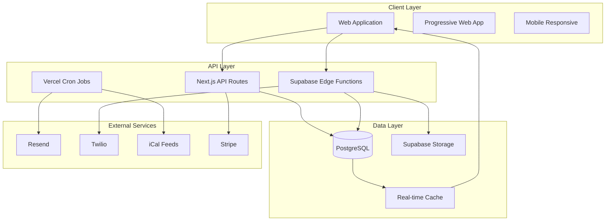

# VRBNBXOSS - Technical Architecture Document

## Executive Summary

### Project Overview
VRBNBXOSS is a comprehensive rental property management dashboard that enables property owners to manage multiple apartments across Airbnb, VRBO, and direct bookings. The system consolidates reservation tracking, cleaning schedules, guest communications, and financial analytics into a unified platform.

### Technology Stack Summary
- **Frontend**: Next.js 14 with TypeScript, Tailwind CSS, and shadcn/ui components
- **Backend**: Supabase (PostgreSQL, Authentication, Edge Functions, Storage, Real-time)
- **Hosting**: Vercel for frontend and API routes with global CDN
- **State Management**: Zustand for client state, TanStack Query for server state
- **Real-time**: Supabase Realtime subscriptions for live updates
- **Security**: Row Level Security (RLS) with database-level authorization

### System Architecture Principles
1. **Real-time First**: Live updates across all connected clients via Supabase Realtime
2. **Security by Design**: Database-level security with RLS policies and encrypted sensitive data
3. **Scalable Foundation**: PostgreSQL with proper indexing and caching strategies
4. **Developer Experience**: TypeScript end-to-end with type-safe API contracts
5. **Performance Optimized**: Edge caching, optimistic updates, and efficient data loading

### Critical Technical Constraints
- **Authentication**: Supabase Auth rate limits (30 requests/hour for password reset)
- **Storage**: 5GB free tier limit for file storage, auto-scaling beyond
- **Real-time**: 200 concurrent connections per project on free tier
- **Edge Functions**: 500,000 invocations/month limit
- **Database**: Unlimited reads/writes with PostgreSQL connection pooling

---

## System Overview & Component Architecture

### Core System Components



### Component Responsibilities

#### Frontend Components (Next.js 14)
- **Authentication Layer**: User login, registration, session management
- **Dashboard Views**: Calendar, reservations, apartments, cleaning, statistics
- **Form Management**: Reservation creation, apartment setup, guest information
- **Real-time Updates**: Live calendar sync, status changes, notifications
- **File Upload**: Image optimization, document management
- **Data Visualization**: Revenue charts, occupancy analytics, platform breakdowns

#### API Layer (Next.js + Supabase)
- **REST API Routes**: CRUD operations for all entities
- **Edge Functions**: Complex business logic, PDF generation, integrations
- **Cron Jobs**: Daily synchronization, automated communications
- **Webhook Handlers**: Platform notifications, payment processing
- **Real-time Subscriptions**: Database change notifications

#### Data Layer (PostgreSQL + Supabase)
- **Transactional Storage**: Reservations, apartments, guests, cleanings
- **File Storage**: Photos, documents, contracts with CDN delivery
- **Real-time Cache**: Subscription management and live updates
- **Audit Logging**: Change tracking and compliance records

---

## Technology Stack Architecture

### Frontend Architecture Decision Matrix

| Technology | Purpose | Rationale |
|------------|---------|-----------|
| **Next.js 14** | Full-stack framework | App Router, Server Components, built-in optimization |
| **TypeScript** | Type safety | Compile-time error detection, better IDE support |
| **Tailwind CSS** | Styling framework | Utility-first, consistent design system, tree-shaking |
| **shadcn/ui** | Component library | Accessible, customizable, no dependency lock-in |
| **Zustand** | Client state | Lightweight, TypeScript-first, minimal boilerplate |
| **TanStack Query** | Server state | Caching, optimistic updates, background refetching |
| **React Hook Form** | Form management | Performance, validation, TypeScript integration |
| **Framer Motion** | Animations | Smooth transitions, layout animations, gesture support |

### Backend Architecture Decision Matrix

| Technology | Purpose | Rationale |
|------------|---------|-----------|
| **Supabase** | Backend platform | PostgreSQL, Auth, Real-time, Storage in one platform |
| **PostgreSQL** | Primary database | ACID compliance, complex queries, full-text search |
| **Row Level Security** | Authorization | Database-level security, automatic policy enforcement |
| **Edge Functions** | Serverless logic | Deno runtime, global deployment, automatic scaling |
| **Vercel** | Hosting platform | Next.js optimization, global CDN, preview deployments |

### Real-time Communication Architecture

```typescript
// Real-time subscription pattern
const subscription = supabase
  .channel('reservations')
  .on('postgres_changes', 
    { 
      event: '*', 
      schema: 'public', 
      table: 'reservations',
      filter: `owner_id=eq.${userId}`
    }, 
    (payload) => {
      // Update local cache
      queryClient.invalidateQueries(['reservations']);
      // Show real-time notification
      toast.success('Reservation updated');
    }
  )
  .subscribe();
```

---

## Database Design & Data Models

### Entity Relationship Diagram

```sql
-- Core entity relationships
profiles (1) ----< (M) apartments
apartments (1) ----< (M) reservations
profiles (1) ----< (M) guests
guests (1) ----< (M) reservations
apartments (1) ----< (M) cleanings
cleaners (M) ----< (1) cleanings
reservations (1) ----< (1) cleanings
reservations (1) ----< (1) contracts
```

### PostgreSQL Schema Implementation

#### User Profiles (Authentication Extension)
```sql
-- Profiles table extends Supabase auth.users
CREATE TABLE public.profiles (
  id UUID PRIMARY KEY REFERENCES auth.users(id) ON DELETE CASCADE,
  full_name TEXT NOT NULL,
  avatar_url TEXT,
  role TEXT DEFAULT 'owner' CHECK (role IN ('owner', 'cleaner', 'admin')),
  timezone TEXT DEFAULT 'UTC',
  settings JSONB DEFAULT '{
    "notifications": {"email": true, "push": true},
    "calendar": {"defaultView": "month"},
    "currency": "EUR"
  }'::jsonb,
  created_at TIMESTAMPTZ DEFAULT NOW(),
  updated_at TIMESTAMPTZ DEFAULT NOW()
);

-- Auto-create profile on user registration
CREATE OR REPLACE FUNCTION public.handle_new_user()
RETURNS TRIGGER AS $$
BEGIN
  INSERT INTO public.profiles (id, full_name, avatar_url)
  VALUES (
    NEW.id,
    COALESCE(NEW.raw_user_meta_data->>'full_name', 'Unknown'),
    NEW.raw_user_meta_data->>'avatar_url'
  );
  RETURN NEW;
END;
$$ LANGUAGE plpgsql SECURITY DEFINER;

CREATE TRIGGER on_auth_user_created
  AFTER INSERT ON auth.users
  FOR EACH ROW EXECUTE FUNCTION public.handle_new_user();
```

#### Apartments (Property Management)
```sql
CREATE TABLE public.apartments (
  id UUID PRIMARY KEY DEFAULT gen_random_uuid(),
  owner_id UUID NOT NULL REFERENCES public.profiles(id) ON DELETE CASCADE,
  name TEXT NOT NULL,
  address JSONB NOT NULL CHECK (
    address ? 'street' AND 
    address ? 'city' AND 
    address ? 'country'
  ),
  capacity INTEGER NOT NULL CHECK (capacity > 0 AND capacity <= 50),
  bedrooms INTEGER CHECK (bedrooms >= 0),
  bathrooms DECIMAL(3,1) CHECK (bathrooms >= 0),
  amenities TEXT[] DEFAULT '{}',
  photos TEXT[] DEFAULT '{}',
  access_codes JSONB DEFAULT '{}', -- Encrypted via trigger
  status TEXT DEFAULT 'active' CHECK (status IN ('active', 'maintenance', 'inactive')),
  timezone TEXT DEFAULT 'UTC',
  created_at TIMESTAMPTZ DEFAULT NOW(),
  updated_at TIMESTAMPTZ DEFAULT NOW()
);

-- Indexes for performance
CREATE INDEX idx_apartments_owner_id ON public.apartments(owner_id);
CREATE INDEX idx_apartments_status ON public.apartments(status);
CREATE INDEX idx_apartments_address_gin ON public.apartments USING GIN (address);
```

#### Reservations (Booking Management)
```sql
CREATE TABLE public.reservations (
  id UUID PRIMARY KEY DEFAULT gen_random_uuid(),
  apartment_id UUID NOT NULL REFERENCES public.apartments(id) ON DELETE CASCADE,
  owner_id UUID NOT NULL REFERENCES public.profiles(id) ON DELETE CASCADE,
  guest_id UUID REFERENCES public.guests(id) ON DELETE SET NULL,
  platform TEXT NOT NULL CHECK (platform IN ('airbnb', 'vrbo', 'direct', 'booking_com')),
  platform_reservation_id TEXT,
  check_in DATE NOT NULL,
  check_out DATE NOT NULL,
  guest_count INTEGER NOT NULL CHECK (guest_count > 0),
  total_price DECIMAL(10,2) NOT NULL CHECK (total_price >= 0),
  cleaning_fee DECIMAL(10,2) DEFAULT 0 CHECK (cleaning_fee >= 0),
  platform_fee DECIMAL(10,2) DEFAULT 0 CHECK (platform_fee >= 0),
  currency TEXT DEFAULT 'EUR',
  status TEXT DEFAULT 'confirmed' CHECK (status IN (
    'draft', 'pending', 'confirmed', 'checked_in', 'checked_out', 'cancelled', 'archived'
  )),
  notes TEXT,
  contact_info JSONB DEFAULT '{}',
  special_requests TEXT,
  created_at TIMESTAMPTZ DEFAULT NOW(),
  updated_at TIMESTAMPTZ DEFAULT NOW(),
  
  -- Business logic constraints
  CONSTRAINT valid_dates CHECK (check_out > check_in),
  CONSTRAINT future_checkin CHECK (check_in >= CURRENT_DATE - INTERVAL '1 day'),
  CONSTRAINT reasonable_stay CHECK (check_out - check_in <= INTERVAL '365 days'),
  CONSTRAINT unique_platform_reservation UNIQUE (platform, platform_reservation_id)
);

-- Comprehensive indexing strategy
CREATE INDEX idx_reservations_owner_id ON public.reservations(owner_id);
CREATE INDEX idx_reservations_apartment_id ON public.reservations(apartment_id);
CREATE INDEX idx_reservations_dates ON public.reservations(check_in, check_out);
CREATE INDEX idx_reservations_status ON public.reservations(status);
CREATE INDEX idx_reservations_platform ON public.reservations(platform);
CREATE INDEX idx_reservations_guest_id ON public.reservations(guest_id);

-- Prevent double booking trigger
CREATE OR REPLACE FUNCTION prevent_double_booking()
RETURNS TRIGGER AS $$
BEGIN
  IF EXISTS (
    SELECT 1 FROM public.reservations 
    WHERE apartment_id = NEW.apartment_id 
    AND status NOT IN ('cancelled', 'archived')
    AND id != COALESCE(NEW.id, '00000000-0000-0000-0000-000000000000'::uuid)
    AND (
      (NEW.check_in >= check_in AND NEW.check_in < check_out) OR
      (NEW.check_out > check_in AND NEW.check_out <= check_out) OR
      (NEW.check_in <= check_in AND NEW.check_out >= check_out)
    )
  ) THEN
    RAISE EXCEPTION 'Apartment is already booked for these dates';
  END IF;
  
  -- Validate guest capacity
  IF NEW.guest_count > (
    SELECT capacity FROM public.apartments WHERE id = NEW.apartment_id
  ) THEN
    RAISE EXCEPTION 'Guest count exceeds apartment capacity';
  END IF;
  
  RETURN NEW;
END;
$$ LANGUAGE plpgsql;

CREATE TRIGGER prevent_double_booking_trigger
  BEFORE INSERT OR UPDATE ON public.reservations
  FOR EACH ROW EXECUTE FUNCTION prevent_double_booking();
```

#### Guests (Contact Management)
```sql
CREATE TABLE public.guests (
  id UUID PRIMARY KEY DEFAULT gen_random_uuid(),
  owner_id UUID NOT NULL REFERENCES public.profiles(id) ON DELETE CASCADE,
  name TEXT NOT NULL,
  email TEXT,
  phone TEXT,
  id_document TEXT, -- Encrypted via trigger
  address JSONB DEFAULT '{}',
  date_of_birth DATE,
  nationality TEXT,
  language TEXT DEFAULT 'en',
  notes TEXT,
  blacklisted BOOLEAN DEFAULT FALSE,
  created_at TIMESTAMPTZ DEFAULT NOW(),
  updated_at TIMESTAMPTZ DEFAULT NOW(),
  
  -- Validation constraints
  CONSTRAINT valid_email CHECK (email ~* '^[A-Za-z0-9._%+-]+@[A-Za-z0-9.-]+\.[A-Za-z]{2,}$' OR email IS NULL),
  CONSTRAINT valid_phone CHECK (phone ~ '^\+?[1-9]\d{1,14}$' OR phone IS NULL)
);

-- Indexes for guest search
CREATE INDEX idx_guests_owner_id ON public.guests(owner_id);
CREATE INDEX idx_guests_email ON public.guests(email);
CREATE INDEX idx_guests_phone ON public.guests(phone);
CREATE INDEX idx_guests_name_gin ON public.guests USING GIN (to_tsvector('english', name));
```

#### Cleanings (Service Management)
```sql
CREATE TABLE public.cleanings (
  id UUID PRIMARY KEY DEFAULT gen_random_uuid(),
  apartment_id UUID NOT NULL REFERENCES public.apartments(id) ON DELETE CASCADE,
  cleaner_id UUID REFERENCES public.cleaners(id) ON DELETE SET NULL,
  reservation_id UUID REFERENCES public.reservations(id) ON DELETE SET NULL,
  owner_id UUID NOT NULL REFERENCES public.profiles(id) ON DELETE CASCADE,
  scheduled_start TIMESTAMPTZ NOT NULL,
  scheduled_end TIMESTAMPTZ NOT NULL,
  actual_start TIMESTAMPTZ,
  actual_end TIMESTAMPTZ,
  status TEXT DEFAULT 'scheduled' CHECK (status IN (
    'needed', 'scheduled', 'in_progress', 'completed', 'cancelled', 'verified'
  )),
  cleaning_type TEXT DEFAULT 'standard' CHECK (cleaning_type IN (
    'standard', 'deep', 'maintenance', 'checkout', 'checkin'
  )),
  instructions TEXT,
  supplies JSONB DEFAULT '{}',
  photos TEXT[] DEFAULT '{}', -- Before/after photos
  cost DECIMAL(8,2) CHECK (cost >= 0),
  currency TEXT DEFAULT 'EUR',
  rating INTEGER CHECK (rating >= 1 AND rating <= 5),
  notes TEXT,
  created_at TIMESTAMPTZ DEFAULT NOW(),
  updated_at TIMESTAMPTZ DEFAULT NOW(),
  
  -- Business logic constraints
  CONSTRAINT valid_schedule CHECK (scheduled_end > scheduled_start),
  CONSTRAINT valid_actual_times CHECK (
    actual_end IS NULL OR actual_start IS NULL OR actual_end >= actual_start
  )
);

-- Indexes for cleaning operations
CREATE INDEX idx_cleanings_apartment_id ON public.cleanings(apartment_id);
CREATE INDEX idx_cleanings_cleaner_id ON public.cleanings(cleaner_id);
CREATE INDEX idx_cleanings_owner_id ON public.cleanings(owner_id);
CREATE INDEX idx_cleanings_status ON public.cleanings(status);
CREATE INDEX idx_cleanings_scheduled ON public.cleanings(scheduled_start, scheduled_end);
```

#### Cleaners (Service Provider Management)
```sql
CREATE TABLE public.cleaners (
  id UUID PRIMARY KEY DEFAULT gen_random_uuid(),
  owner_id UUID NOT NULL REFERENCES public.profiles(id) ON DELETE CASCADE,
  user_id UUID REFERENCES public.profiles(id) ON DELETE SET NULL, -- If cleaner has account
  name TEXT NOT NULL,
  email TEXT,
  phone TEXT,
  hourly_rate DECIMAL(6,2) CHECK (hourly_rate >= 0),
  flat_rate DECIMAL(8,2) CHECK (flat_rate >= 0),
  currency TEXT DEFAULT 'EUR',
  availability JSONB DEFAULT '{}', -- Weekly schedule
  services TEXT[] DEFAULT '{}', -- Types of cleaning offered
  supplies_included BOOLEAN DEFAULT FALSE,
  rating DECIMAL(2,1) CHECK (rating >= 0 AND rating <= 5),
  total_cleanings INTEGER DEFAULT 0,
  active BOOLEAN DEFAULT TRUE,
  notes TEXT,
  created_at TIMESTAMPTZ DEFAULT NOW(),
  updated_at TIMESTAMPTZ DEFAULT NOW(),
  
  CONSTRAINT valid_email CHECK (email ~* '^[A-Za-z0-9._%+-]+@[A-Za-z0-9.-]+\.[A-Za-z]{2,}$' OR email IS NULL),
  CONSTRAINT valid_phone CHECK (phone ~ '^\+?[1-9]\d{1,14}$' OR phone IS NULL)
);

-- Indexes for cleaner management
CREATE INDEX idx_cleaners_owner_id ON public.cleaners(owner_id);
CREATE INDEX idx_cleaners_active ON public.cleaners(active);
CREATE INDEX idx_cleaners_rating ON public.cleaners(rating);
```

### Caching Strategy & Performance Optimization

#### Query Optimization Patterns
```sql
-- Materialized view for dashboard statistics
CREATE MATERIALIZED VIEW public.reservation_stats AS
SELECT 
  owner_id,
  apartment_id,
  DATE_TRUNC('month', check_in) as month,
  COUNT(*) as total_reservations,
  SUM(total_price) as total_revenue,
  AVG(total_price) as avg_price,
  SUM(check_out - check_in) as total_nights,
  COUNT(DISTINCT guest_id) as unique_guests
FROM public.reservations 
WHERE status NOT IN ('cancelled', 'archived')
GROUP BY owner_id, apartment_id, DATE_TRUNC('month', check_in);

-- Refresh strategy
CREATE OR REPLACE FUNCTION refresh_reservation_stats()
RETURNS VOID AS $$
BEGIN
  REFRESH MATERIALIZED VIEW CONCURRENTLY public.reservation_stats;
END;
$$ LANGUAGE plpgsql;

-- Auto-refresh trigger
CREATE OR REPLACE FUNCTION trigger_stats_refresh()
RETURNS TRIGGER AS $$
BEGIN
  PERFORM pg_notify('refresh_stats', 'reservation_updated');
  RETURN COALESCE(NEW, OLD);
END;
$$ LANGUAGE plpgsql;

CREATE TRIGGER refresh_stats_on_reservation_change
  AFTER INSERT OR UPDATE OR DELETE ON public.reservations
  FOR EACH ROW EXECUTE FUNCTION trigger_stats_refresh();
```

---

## API Architecture & Contracts

### API Design Principles
1. **RESTful Design**: Standard HTTP methods with predictable URL patterns
2. **Type Safety**: TypeScript interfaces shared between client and server
3. **Error Handling**: Consistent error response format with proper HTTP status codes
4. **Validation**: Input validation with Zod schemas on both client and server
5. **Performance**: Optimistic updates with server reconciliation

### API Route Structure

```typescript
// Next.js API routes organization
app/api/
├── auth/
│   ├── callback/route.ts          // OAuth callback handler
│   └── logout/route.ts            // Session cleanup
├── apartments/
│   ├── route.ts                   // GET /api/apartments, POST /api/apartments
│   ├── [id]/route.ts              // GET/PUT/DELETE /api/apartments/[id]
│   └── [id]/photos/route.ts       // POST /api/apartments/[id]/photos
├── reservations/
│   ├── route.ts                   // GET /api/reservations, POST /api/reservations
│   ├── [id]/route.ts              // GET/PUT/DELETE /api/reservations/[id]
│   └── availability/route.ts      // GET /api/reservations/availability
├── guests/
│   ├── route.ts                   // GET /api/guests, POST /api/guests
│   ├── [id]/route.ts              // GET/PUT/DELETE /api/guests/[id]
│   └── search/route.ts            // GET /api/guests/search
├── cleanings/
│   ├── route.ts                   // GET /api/cleanings, POST /api/cleanings
│   ├── [id]/route.ts              // GET/PUT/DELETE /api/cleanings/[id]
│   └── schedule/route.ts          // GET /api/cleanings/schedule
├── statistics/
│   ├── dashboard/route.ts         // GET /api/statistics/dashboard
│   ├── revenue/route.ts           // GET /api/statistics/revenue
│   └── occupancy/route.ts         // GET /api/statistics/occupancy
├── webhooks/
│   ├── stripe/route.ts            // POST /api/webhooks/stripe
│   └── calendar-sync/route.ts     // POST /api/webhooks/calendar-sync
└── cron/
    ├── daily-sync/route.ts        // GET /api/cron/daily-sync
    └── send-reminders/route.ts    // GET /api/cron/send-reminders
```

### API Contract Specifications

#### Reservation Management API
```typescript
// Shared types for type safety
interface Reservation {
  id: string;
  apartment_id: string;
  guest_id?: string;
  platform: 'airbnb' | 'vrbo' | 'direct' | 'booking_com';
  platform_reservation_id?: string;
  check_in: string; // ISO date string
  check_out: string; // ISO date string
  guest_count: number;
  total_price: number;
  cleaning_fee: number;
  platform_fee: number;
  currency: string;
  status: 'draft' | 'pending' | 'confirmed' | 'checked_in' | 'checked_out' | 'cancelled' | 'archived';
  notes?: string;
  contact_info: Record<string, any>;
  special_requests?: string;
  created_at: string;
  updated_at: string;
}

// API endpoint implementations
// GET /api/reservations
export async function GET(request: Request) {
  const { searchParams } = new URL(request.url);
  const apartment_id = searchParams.get('apartment_id');
  const status = searchParams.get('status');
  const start_date = searchParams.get('start_date');
  const end_date = searchParams.get('end_date');
  
  try {
    const { data: { user } } = await supabase.auth.getUser();
    if (!user) throw new Error('Unauthorized');
    
    let query = supabase
      .from('reservations')
      .select(`
        *,
        apartment:apartments(id, name, address),
        guest:guests(id, name, email, phone)
      `)
      .eq('owner_id', user.id);
    
    // Apply filters
    if (apartment_id) query = query.eq('apartment_id', apartment_id);
    if (status) query = query.eq('status', status);
    if (start_date) query = query.gte('check_in', start_date);
    if (end_date) query = query.lte('check_out', end_date);
    
    const { data, error } = await query.order('check_in', { ascending: true });
    
    if (error) throw error;
    
    return Response.json({
      success: true,
      data: data as Reservation[]
    });
  } catch (error) {
    return Response.json(
      { success: false, error: error.message },
      { status: error.message === 'Unauthorized' ? 401 : 500 }
    );
  }
}

// POST /api/reservations
export async function POST(request: Request) {
  try {
    const body = await request.json();
    
    // Validate input with Zod
    const reservationSchema = z.object({
      apartment_id: z.string().uuid(),
      guest_id: z.string().uuid().optional(),
      platform: z.enum(['airbnb', 'vrbo', 'direct', 'booking_com']),
      platform_reservation_id: z.string().optional(),
      check_in: z.string().pipe(z.coerce.date()),
      check_out: z.string().pipe(z.coerce.date()),
      guest_count: z.number().min(1).max(50),
      total_price: z.number().min(0),
      cleaning_fee: z.number().min(0).default(0),
      platform_fee: z.number().min(0).default(0),
      currency: z.string().default('EUR'),
      notes: z.string().optional(),
      contact_info: z.record(z.any()).default({}),
      special_requests: z.string().optional()
    });
    
    const validatedData = reservationSchema.parse(body);
    
    const { data: { user } } = await supabase.auth.getUser();
    if (!user) throw new Error('Unauthorized');
    
    // Create reservation with automatic conflict checking (via database trigger)
    const { data, error } = await supabase
      .from('reservations')
      .insert({
        ...validatedData,
        owner_id: user.id,
        status: 'confirmed'
      })
      .select(`
        *,
        apartment:apartments(id, name, address),
        guest:guests(id, name, email, phone)
      `)
      .single();
    
    if (error) throw error;
    
    // Trigger real-time update
    await supabase
      .channel('reservations')
      .send({
        type: 'broadcast',
        event: 'reservation_created',
        payload: { reservation: data }
      });
    
    return Response.json({
      success: true,
      data: data as Reservation
    }, { status: 201 });
    
  } catch (error) {
    if (error instanceof z.ZodError) {
      return Response.json(
        { success: false, error: 'Validation failed', details: error.errors },
        { status: 400 }
      );
    }
    
    return Response.json(
      { success: false, error: error.message },
      { status: error.message === 'Unauthorized' ? 401 : 500 }
    );
  }
}
```

#### Availability Checking API
```typescript
// GET /api/reservations/availability
export async function GET(request: Request) {
  const { searchParams } = new URL(request.url);
  const apartment_id = searchParams.get('apartment_id');
  const check_in = searchParams.get('check_in');
  const check_out = searchParams.get('check_out');
  
  if (!apartment_id || !check_in || !check_out) {
    return Response.json(
      { success: false, error: 'Missing required parameters' },
      { status: 400 }
    );
  }
  
  try {
    const { data: { user } } = await supabase.auth.getUser();
    if (!user) throw new Error('Unauthorized');
    
    // Check for conflicts
    const { data: conflicts, error } = await supabase
      .from('reservations')
      .select('id, check_in, check_out, platform, status')
      .eq('apartment_id', apartment_id)
      .eq('owner_id', user.id)
      .not('status', 'in', '(cancelled,archived)')
      .or(`and(check_in.lt.${check_out},check_out.gt.${check_in})`);
    
    if (error) throw error;
    
    const isAvailable = conflicts.length === 0;
    
    return Response.json({
      success: true,
      data: {
        available: isAvailable,
        conflicts: conflicts || [],
        apartment_id,
        check_in,
        check_out
      }
    });
    
  } catch (error) {
    return Response.json(
      { success: false, error: error.message },
      { status: 500 }
    );
  }
}
```

### Error Handling Strategy

```typescript
// Standardized error response format
interface APIError {
  success: false;
  error: string;
  code?: string;
  details?: any;
  timestamp: string;
}

interface APISuccess<T = any> {
  success: true;
  data: T;
  meta?: {
    pagination?: {
      page: number;
      limit: number;
      total: number;
      totalPages: number;
    };
  };
}

// Global error handler middleware
export function withErrorHandler<T extends any[], R>(
  handler: (...args: T) => Promise<Response>
) {
  return async (...args: T): Promise<Response> => {
    try {
      return await handler(...args);
    } catch (error) {
      console.error('API Error:', error);
      
      // Database constraint errors
      if (error.code === '23505') { // Unique violation
        return Response.json({
          success: false,
          error: 'Resource already exists',
          code: 'DUPLICATE_ERROR',
          timestamp: new Date().toISOString()
        }, { status: 409 });
      }
      
      // Foreign key constraint
      if (error.code === '23503') {
        return Response.json({
          success: false,
          error: 'Referenced resource does not exist',
          code: 'REFERENCE_ERROR',
          timestamp: new Date().toISOString()
        }, { status: 400 });
      }
      
      // Check constraint
      if (error.code === '23514') {
        return Response.json({
          success: false,
          error: 'Data validation failed',
          code: 'VALIDATION_ERROR',
          details: error.message,
          timestamp: new Date().toISOString()
        }, { status: 400 });
      }
      
      // Default error
      return Response.json({
        success: false,
        error: 'Internal server error',
        code: 'INTERNAL_ERROR',
        timestamp: new Date().toISOString()
      }, { status: 500 });
    }
  };
}
```

---

## Authentication & Security Architecture

### Supabase Authentication Implementation

#### Authentication Flow Design
```typescript
// Authentication service layer
class AuthService {
  private supabase = createClientComponentClient();
  
  async signUp(email: string, password: string, userData: {
    full_name: string;
    timezone?: string;
  }) {
    const { data, error } = await this.supabase.auth.signUp({
      email,
      password,
      options: {
        data: userData,
        emailRedirectTo: `${window.location.origin}/auth/callback`
      }
    });
    
    if (error) throw new AuthError(error.message);
    return data;
  }
  
  async signIn(email: string, password: string) {
    const { data, error } = await this.supabase.auth.signInWithPassword({
      email,
      password
    });
    
    if (error) throw new AuthError(error.message);
    return data;
  }
  
  async signInWithProvider(provider: 'google' | 'facebook') {
    const { data, error } = await this.supabase.auth.signInWithOAuth({
      provider,
      options: {
        redirectTo: `${window.location.origin}/auth/callback`
      }
    });
    
    if (error) throw new AuthError(error.message);
    return data;
  }
  
  async signOut() {
    const { error } = await this.supabase.auth.signOut();
    if (error) throw new AuthError(error.message);
  }
  
  async resetPassword(email: string) {
    const { error } = await this.supabase.auth.resetPasswordForEmail(email, {
      redirectTo: `${window.location.origin}/auth/reset-password`
    });
    
    if (error) throw new AuthError(error.message);
  }
  
  async updatePassword(newPassword: string) {
    const { error } = await this.supabase.auth.updateUser({
      password: newPassword
    });
    
    if (error) throw new AuthError(error.message);
  }
}
```

#### Row Level Security Policies

```sql
-- Enable RLS on all tables
ALTER TABLE public.profiles ENABLE ROW LEVEL SECURITY;
ALTER TABLE public.apartments ENABLE ROW LEVEL SECURITY;
ALTER TABLE public.reservations ENABLE ROW LEVEL SECURITY;
ALTER TABLE public.guests ENABLE ROW LEVEL SECURITY;
ALTER TABLE public.cleanings ENABLE ROW LEVEL SECURITY;
ALTER TABLE public.cleaners ENABLE ROW LEVEL SECURITY;

-- Profiles: Users can only access their own profile
CREATE POLICY "Users can view own profile" ON public.profiles
  FOR SELECT USING (auth.uid() = id);

CREATE POLICY "Users can update own profile" ON public.profiles
  FOR UPDATE USING (auth.uid() = id);

-- Apartments: Owners can access their apartments
CREATE POLICY "Owners can manage their apartments" ON public.apartments
  FOR ALL USING (auth.uid() = owner_id);

-- Reservations: Owners can access their reservations
CREATE POLICY "Owners can manage their reservations" ON public.reservations
  FOR ALL USING (auth.uid() = owner_id);

-- Guests: Owners can access their guests
CREATE POLICY "Owners can manage their guests" ON public.guests
  FOR ALL USING (auth.uid() = owner_id);

-- Cleanings: Owners and assigned cleaners can access
CREATE POLICY "Cleanings access policy" ON public.cleanings
  FOR SELECT USING (
    auth.uid() = owner_id OR
    auth.uid() = (SELECT user_id FROM public.cleaners WHERE id = cleaner_id)
  );

CREATE POLICY "Owners can manage cleanings" ON public.cleanings
  FOR INSERT WITH CHECK (auth.uid() = owner_id);

CREATE POLICY "Owners can update cleanings" ON public.cleanings
  FOR UPDATE USING (auth.uid() = owner_id);

CREATE POLICY "Owners can delete cleanings" ON public.cleanings
  FOR DELETE USING (auth.uid() = owner_id);

-- Cleaners: Special policies for cleaner access
CREATE POLICY "Cleaners can view assigned cleanings" ON public.cleanings
  FOR SELECT USING (
    auth.uid() = (SELECT user_id FROM public.cleaners WHERE id = cleaner_id)
  );

CREATE POLICY "Cleaners can update cleaning status" ON public.cleanings
  FOR UPDATE USING (
    auth.uid() = (SELECT user_id FROM public.cleaners WHERE id = cleaner_id)
  ) WITH CHECK (
    -- Cleaners can only update specific fields
    OLD.owner_id = NEW.owner_id AND
    OLD.apartment_id = NEW.apartment_id AND
    OLD.cleaner_id = NEW.cleaner_id AND
    OLD.scheduled_start = NEW.scheduled_start AND
    OLD.scheduled_end = NEW.scheduled_end
  );
```

#### Data Encryption Implementation

```sql
-- Encryption functions for sensitive data
CREATE EXTENSION IF NOT EXISTS pgcrypto;

-- Encrypt access codes trigger
CREATE OR REPLACE FUNCTION encrypt_access_codes()
RETURNS TRIGGER AS $$
BEGIN
  -- Encrypt WiFi passwords and door codes
  IF NEW.access_codes IS NOT NULL THEN
    NEW.access_codes = jsonb_build_object(
      'wifi_password', CASE 
        WHEN NEW.access_codes->>'wifi_password' IS NOT NULL 
        THEN encode(pgp_sym_encrypt(NEW.access_codes->>'wifi_password', current_setting('app.encryption_key')), 'base64')
        ELSE NULL
      END,
      'door_code', CASE 
        WHEN NEW.access_codes->>'door_code' IS NOT NULL 
        THEN encode(pgp_sym_encrypt(NEW.access_codes->>'door_code', current_setting('app.encryption_key')), 'base64')
        ELSE NULL
      END,
      'building_code', CASE 
        WHEN NEW.access_codes->>'building_code' IS NOT NULL 
        THEN encode(pgp_sym_encrypt(NEW.access_codes->>'building_code', current_setting('app.encryption_key')), 'base64')
        ELSE NULL
      END
    );
  END IF;
  
  RETURN NEW;
END;
$$ LANGUAGE plpgsql SECURITY DEFINER;

CREATE TRIGGER encrypt_apartment_access_codes
  BEFORE INSERT OR UPDATE ON public.apartments
  FOR EACH ROW EXECUTE FUNCTION encrypt_access_codes();

-- Decrypt function for application use
CREATE OR REPLACE FUNCTION decrypt_access_codes(codes JSONB)
RETURNS JSONB AS $$
BEGIN
  IF codes IS NULL THEN
    RETURN NULL;
  END IF;
  
  RETURN jsonb_build_object(
    'wifi_password', CASE 
      WHEN codes->>'wifi_password' IS NOT NULL 
      THEN pgp_sym_decrypt(decode(codes->>'wifi_password', 'base64'), current_setting('app.encryption_key'))
      ELSE NULL
    END,
    'door_code', CASE 
      WHEN codes->>'door_code' IS NOT NULL 
      THEN pgp_sym_decrypt(decode(codes->>'door_code', 'base64'), current_setting('app.encryption_key'))
      ELSE NULL
    END,
    'building_code', CASE 
      WHEN codes->>'building_code' IS NOT NULL 
      THEN pgp_sym_decrypt(decode(codes->>'building_code', 'base64'), current_setting('app.encryption_key'))
      ELSE NULL
    END
  );
END;
$$ LANGUAGE plpgsql SECURITY DEFINER;
```

#### Session Management & Middleware

```typescript
// Next.js middleware for authentication
import { createMiddlewareClient } from '@supabase/auth-helpers-nextjs';
import { NextResponse } from 'next/server';
import type { NextRequest } from 'next/server';

export async function middleware(req: NextRequest) {
  const res = NextResponse.next();
  const supabase = createMiddlewareClient({ req, res });
  
  // Refresh session if expired
  const { data: { session } } = await supabase.auth.getSession();
  
  // Protected routes
  const protectedPaths = ['/dashboard', '/calendar', '/reservations', '/apartments', '/cleaning', '/statistics', '/settings'];
  const isProtectedPath = protectedPaths.some(path => req.nextUrl.pathname.startsWith(path));
  
  // Redirect to login if accessing protected route without session
  if (isProtectedPath && !session) {
    return NextResponse.redirect(new URL('/auth/login', req.url));
  }
  
  // Redirect to dashboard if accessing auth pages with session
  const authPaths = ['/auth/login', '/auth/register', '/auth/forgot-password'];
  const isAuthPath = authPaths.some(path => req.nextUrl.pathname.startsWith(path));
  
  if (isAuthPath && session) {
    return NextResponse.redirect(new URL('/dashboard', req.url));
  }
  
  return res;
}

export const config = {
  matcher: [
    '/dashboard/:path*',
    '/calendar/:path*',
    '/reservations/:path*',
    '/apartments/:path*',
    '/cleaning/:path*',
    '/statistics/:path*',
    '/settings/:path*',
    '/auth/:path*'
  ]
};
```

### Security Monitoring & Audit Logging

```sql
-- Audit log table for compliance
CREATE TABLE public.audit_logs (
  id UUID PRIMARY KEY DEFAULT gen_random_uuid(),
  table_name TEXT NOT NULL,
  record_id UUID NOT NULL,
  action TEXT NOT NULL CHECK (action IN ('INSERT', 'UPDATE', 'DELETE')),
  old_values JSONB,
  new_values JSONB,
  user_id UUID REFERENCES auth.users(id),
  user_ip INET,
  user_agent TEXT,
  timestamp TIMESTAMPTZ DEFAULT NOW()
);

-- Generic audit trigger function
CREATE OR REPLACE FUNCTION audit_trigger_function()
RETURNS TRIGGER AS $$
BEGIN
  INSERT INTO public.audit_logs (
    table_name,
    record_id,
    action,
    old_values,
    new_values,
    user_id,
    user_ip,
    user_agent
  ) VALUES (
    TG_TABLE_NAME,
    COALESCE(NEW.id, OLD.id),
    TG_OP,
    CASE WHEN TG_OP IN ('UPDATE', 'DELETE') THEN to_jsonb(OLD) ELSE NULL END,
    CASE WHEN TG_OP IN ('INSERT', 'UPDATE') THEN to_jsonb(NEW) ELSE NULL END,
    auth.uid(),
    inet_client_addr(),
    current_setting('request.headers', true)::json->>'user-agent'
  );
  
  RETURN COALESCE(NEW, OLD);
END;
$$ LANGUAGE plpgsql SECURITY DEFINER;

-- Apply audit triggers to sensitive tables
CREATE TRIGGER audit_apartments
  AFTER INSERT OR UPDATE OR DELETE ON public.apartments
  FOR EACH ROW EXECUTE FUNCTION audit_trigger_function();

CREATE TRIGGER audit_reservations
  AFTER INSERT OR UPDATE OR DELETE ON public.reservations
  FOR EACH ROW EXECUTE FUNCTION audit_trigger_function();

CREATE TRIGGER audit_guests
  AFTER INSERT OR UPDATE OR DELETE ON public.guests
  FOR EACH ROW EXECUTE FUNCTION audit_trigger_function();
```

---

## Real-time & Performance Architecture

### Supabase Realtime Implementation

#### Real-time Subscription Management
```typescript
// Real-time service for managing subscriptions
class RealtimeService {
  private subscriptions = new Map<string, RealtimeChannel>();
  private supabase = createClientComponentClient();
  
  subscribeToReservations(ownerId: string, callbacks: {
    onInsert?: (payload: any) => void;
    onUpdate?: (payload: any) => void;
    onDelete?: (payload: any) => void;
  }) {
    const channelName = `reservations_${ownerId}`;
    
    if (this.subscriptions.has(channelName)) {
      return this.subscriptions.get(channelName);
    }
    
    const channel = this.supabase
      .channel(channelName)
      .on(
        'postgres_changes',
        {
          event: 'INSERT',
          schema: 'public',
          table: 'reservations',
          filter: `owner_id=eq.${ownerId}`
        },
        (payload) => {
          callbacks.onInsert?.(payload);
          // Trigger client cache invalidation
          queryClient.invalidateQueries(['reservations']);
          // Show notification
          toast.success('New reservation added');
        }
      )
      .on(
        'postgres_changes',
        {
          event: 'UPDATE',
          schema: 'public',
          table: 'reservations',
          filter: `owner_id=eq.${ownerId}`
        },
        (payload) => {
          callbacks.onUpdate?.(payload);
          queryClient.invalidateQueries(['reservations']);
          // Show update notification with details
          const reservation = payload.new as Reservation;
          toast.info(`Reservation ${reservation.platform_reservation_id || reservation.id} updated`);
        }
      )
      .on(
        'postgres_changes',
        {
          event: 'DELETE',
          schema: 'public',
          table: 'reservations',
          filter: `owner_id=eq.${ownerId}`
        },
        (payload) => {
          callbacks.onDelete?.(payload);
          queryClient.invalidateQueries(['reservations']);
          toast.warning('Reservation cancelled');
        }
      )
      .subscribe();
    
    this.subscriptions.set(channelName, channel);
    return channel;
  }
  
  subscribeToCleanings(ownerId: string, callbacks: {
    onStatusChange?: (payload: any) => void;
  }) {
    const channelName = `cleanings_${ownerId}`;
    
    const channel = this.supabase
      .channel(channelName)
      .on(
        'postgres_changes',
        {
          event: 'UPDATE',
          schema: 'public',
          table: 'cleanings',
          filter: `owner_id=eq.${ownerId}`
        },
        (payload) => {
          // Only trigger for status changes
          if (payload.old.status !== payload.new.status) {
            callbacks.onStatusChange?.(payload);
            queryClient.invalidateQueries(['cleanings']);
            
            const statusMessages = {
              'in_progress': 'Cleaning started',
              'completed': 'Cleaning completed',
              'cancelled': 'Cleaning cancelled'
            };
            
            const message = statusMessages[payload.new.status];
            if (message) {
              toast.info(message);
            }
          }
        }
      )
      .subscribe();
    
    this.subscriptions.set(channelName, channel);
    return channel;
  }
  
  unsubscribe(channelName: string) {
    const channel = this.subscriptions.get(channelName);
    if (channel) {
      this.supabase.removeChannel(channel);
      this.subscriptions.delete(channelName);
    }
  }
  
  unsubscribeAll() {
    this.subscriptions.forEach((channel, name) => {
      this.supabase.removeChannel(channel);
    });
    this.subscriptions.clear();
  }
}

// React hook for real-time subscriptions
export function useRealtimeSubscription(userId: string) {
  const realtimeService = useMemo(() => new RealtimeService(), []);
  
  useEffect(() => {
    if (!userId) return;
    
    // Subscribe to reservations
    realtimeService.subscribeToReservations(userId, {
      onInsert: (payload) => {
        // Handle new reservation logic
        queryClient.setQueryData(['reservations'], (old: Reservation[]) => {
          return [...(old || []), payload.new];
        });
      },
      onUpdate: (payload) => {
        // Update specific reservation in cache
        queryClient.setQueryData(['reservations'], (old: Reservation[]) => {
          return old?.map(reservation => 
            reservation.id === payload.new.id ? payload.new : reservation
          ) || [];
        });
      },
      onDelete: (payload) => {
        // Remove reservation from cache
        queryClient.setQueryData(['reservations'], (old: Reservation[]) => {
          return old?.filter(reservation => reservation.id !== payload.old.id) || [];
        });
      }
    });
    
    // Subscribe to cleanings
    realtimeService.subscribeToCleanings(userId, {
      onStatusChange: (payload) => {
        // Update cleaning status in cache
        queryClient.setQueryData(['cleanings'], (old: Cleaning[]) => {
          return old?.map(cleaning => 
            cleaning.id === payload.new.id ? payload.new : cleaning
          ) || [];
        });
      }
    });
    
    return () => {
      realtimeService.unsubscribeAll();
    };
  }, [userId, realtimeService]);
  
  return realtimeService;
}
```

### Performance Optimization Strategy

#### Client-Side Caching with TanStack Query
```typescript
// Query client configuration
export const queryClient = new QueryClient({
  defaultOptions: {
    queries: {
      staleTime: 5 * 60 * 1000, // 5 minutes
      cacheTime: 10 * 60 * 1000, // 10 minutes
      retry: (failureCount, error) => {
        // Don't retry on 4xx errors
        if (error?.status >= 400 && error?.status < 500) {
          return false;
        }
        return failureCount < 3;
      },
      refetchOnWindowFocus: false,
      refetchOnReconnect: true
    },
    mutations: {
      retry: 1,
      onError: (error) => {
        // Global error handling
        toast.error(error.message || 'An error occurred');
      }
    }
  }
});

// Optimized data fetching hooks
export function useReservations(filters?: {
  apartment_id?: string;
  status?: string;
  start_date?: string;
  end_date?: string;
}) {
  return useQuery({
    queryKey: ['reservations', filters],
    queryFn: async () => {
      const params = new URLSearchParams();
      if (filters?.apartment_id) params.set('apartment_id', filters.apartment_id);
      if (filters?.status) params.set('status', filters.status);
      if (filters?.start_date) params.set('start_date', filters.start_date);
      if (filters?.end_date) params.set('end_date', filters.end_date);
      
      const response = await fetch(`/api/reservations?${params}`);
      if (!response.ok) throw new Error('Failed to fetch reservations');
      
      const result = await response.json();
      if (!result.success) throw new Error(result.error);
      
      return result.data as Reservation[];
    },
    staleTime: 2 * 60 * 1000, // 2 minutes for reservations
    enabled: true
  });
}

// Optimistic mutation for reservations
export function useCreateReservation() {
  const queryClient = useQueryClient();
  
  return useMutation({
    mutationFn: async (reservationData: CreateReservationData) => {
      const response = await fetch('/api/reservations', {
        method: 'POST',
        headers: { 'Content-Type': 'application/json' },
        body: JSON.stringify(reservationData)
      });
      
      if (!response.ok) {
        const error = await response.json();
        throw new Error(error.error || 'Failed to create reservation');
      }
      
      const result = await response.json();
      return result.data as Reservation;
    },
    onMutate: async (newReservation) => {
      // Cancel outgoing refetches
      await queryClient.cancelQueries(['reservations']);
      
      // Snapshot previous value
      const previousReservations = queryClient.getQueryData(['reservations']);
      
      // Optimistically update cache
      queryClient.setQueryData(['reservations'], (old: Reservation[]) => {
        const optimisticReservation: Reservation = {
          ...newReservation,
          id: `temp-${Date.now()}`,
          status: 'confirmed',
          created_at: new Date().toISOString(),
          updated_at: new Date().toISOString()
        };
        return [...(old || []), optimisticReservation];
      });
      
      return { previousReservations };
    },
    onError: (err, newReservation, context) => {
      // Rollback on error
      queryClient.setQueryData(['reservations'], context?.previousReservations);
    },
    onSettled: () => {
      // Always refetch after error or success
      queryClient.invalidateQueries(['reservations']);
    }
  });
}
```

#### Database Performance Optimization

```sql
-- Query performance indexes
CREATE INDEX CONCURRENTLY idx_reservations_owner_dates 
ON public.reservations(owner_id, check_in, check_out);

CREATE INDEX CONCURRENTLY idx_reservations_apartment_dates 
ON public.reservations(apartment_id, check_in, check_out) 
WHERE status NOT IN ('cancelled', 'archived');

CREATE INDEX CONCURRENTLY idx_cleanings_scheduled_dates 
ON public.cleanings(apartment_id, scheduled_start, scheduled_end);

-- Partial indexes for active records
CREATE INDEX CONCURRENTLY idx_apartments_active 
ON public.apartments(owner_id) 
WHERE status = 'active';

CREATE INDEX CONCURRENTLY idx_reservations_active 
ON public.reservations(apartment_id, check_in, check_out) 
WHERE status IN ('confirmed', 'checked_in');

-- GIN indexes for JSON searches
CREATE INDEX CONCURRENTLY idx_apartments_amenities_gin 
ON public.apartments USING GIN (amenities);

CREATE INDEX CONCURRENTLY idx_guests_search_gin 
ON public.guests USING GIN (to_tsvector('english', name || ' ' || COALESCE(email, '') || ' ' || COALESCE(phone, '')));

-- Performance monitoring view
CREATE VIEW public.performance_stats AS
SELECT 
  schemaname,
  tablename,
  attname,
  n_distinct,
  correlation,
  most_common_vals
FROM pg_stats 
WHERE schemaname = 'public' 
  AND tablename IN ('reservations', 'apartments', 'cleanings', 'guests');
```

#### Image Optimization & CDN Strategy

```typescript
// Image optimization Edge Function
// supabase/functions/optimize-image/index.ts
import { serve } from 'https://deno.land/std@0.168.0/http/server.ts';
import { createClient } from 'https://esm.sh/@supabase/supabase-js@2';
import Sharp from 'https://deno.land/x/sharp@0.32.6/mod.ts';

serve(async (req) => {
  try {
    const { image, options = {} } = await req.json();
    const { width = 800, height = 600, quality = 80, format = 'webp' } = options;
    
    // Decode base64 image
    const imageBuffer = Uint8Array.from(atob(image), c => c.charCodeAt(0));
    
    // Optimize image
    const optimized = await Sharp(imageBuffer)
      .resize(width, height, { 
        fit: 'inside',
        withoutEnlargement: true 
      })
      .toFormat(format, { quality })
      .toBuffer();
    
    // Upload to Supabase Storage
    const supabase = createClient(
      Deno.env.get('SUPABASE_URL')!,
      Deno.env.get('SUPABASE_SERVICE_ROLE_KEY')!
    );
    
    const fileName = `${crypto.randomUUID()}.${format}`;
    const { data, error } = await supabase.storage
      .from('apartment-photos')
      .upload(fileName, optimized, {
        contentType: `image/${format}`,
        cacheControl: '31536000' // 1 year cache
      });
    
    if (error) throw error;
    
    // Get public URL
    const { data: { publicUrl } } = supabase.storage
      .from('apartment-photos')
      .getPublicUrl(fileName);
    
    return new Response(JSON.stringify({
      success: true,
      url: publicUrl,
      size: optimized.length
    }), {
      headers: { 'Content-Type': 'application/json' }
    });
    
  } catch (error) {
    return new Response(JSON.stringify({
      success: false,
      error: error.message
    }), { 
      status: 500,
      headers: { 'Content-Type': 'application/json' }
    });
  }
});
```

---

## External Integrations Architecture

### Calendar Synchronization (V2.0)

#### iCal Feed Integration
```typescript
// Vercel Cron Job for calendar synchronization
// app/api/cron/sync-calendars/route.ts
import { NextResponse } from 'next/server';
import { createRouteHandlerClient } from '@supabase/auth-helpers-nextjs';
import { cookies } from 'next/headers';
import ICAL from 'node-ical';

export async function GET() {
  try {
    const supabase = createRouteHandlerClient({ cookies });
    
    // Get all apartments with iCal URLs
    const { data: apartments, error } = await supabase
      .from('apartments')
      .select('id, owner_id, ical_urls')
      .not('ical_urls', 'is', null);
    
    if (error) throw error;
    
    for (const apartment of apartments) {
      const icalUrls = apartment.ical_urls as string[];
      
      for (const url of icalUrls) {
        try {
          await syncCalendarFeed(apartment, url);
        } catch (feedError) {
          console.error(`Failed to sync calendar for apartment ${apartment.id}:`, feedError);
        }
      }
    }
    
    return NextResponse.json({ 
      success: true, 
      synced: apartments.length 
    });
    
  } catch (error) {
    console.error('Calendar sync error:', error);
    return NextResponse.json(
      { success: false, error: error.message },
      { status: 500 }
    );
  }
}

async function syncCalendarFeed(apartment: any, icalUrl: string) {
  const supabase = createRouteHandlerClient({ cookies });
  
  // Fetch iCal data
  const response = await fetch(icalUrl);
  if (!response.ok) throw new Error(`Failed to fetch iCal: ${response.statusText}`);
  
  const icalData = await response.text();
  const events = ICAL.sync.parseICS(icalData);
  
  const reservationsToUpsert = [];
  
  for (const [key, event] of Object.entries(events)) {
    if (event.type === 'VEVENT') {
      const startDate = new Date(event.start);
      const endDate = new Date(event.end);
      
      // Skip past events
      if (endDate < new Date()) continue;
      
      // Determine platform from URL or summary
      let platform = 'direct';
      if (icalUrl.includes('airbnb.com')) platform = 'airbnb';
      else if (icalUrl.includes('vrbo.com')) platform = 'vrbo';
      else if (icalUrl.includes('booking.com')) platform = 'booking_com';
      
      const reservation = {
        apartment_id: apartment.id,
        owner_id: apartment.owner_id,
        platform,
        platform_reservation_id: event.uid,
        check_in: startDate.toISOString().split('T')[0],
        check_out: endDate.toISOString().split('T')[0],
        guest_count: 1, // Default, can be parsed from summary
        total_price: 0, // Not available in iCal
        status: 'confirmed',
        notes: `Imported from ${platform} calendar`,
        contact_info: {},
        synced_at: new Date().toISOString()
      };
      
      reservationsToUpsert.push(reservation);
    }
  }
  
  // Upsert reservations (insert or update)
  if (reservationsToUpsert.length > 0) {
    const { error } = await supabase
      .from('reservations')
      .upsert(reservationsToUpsert, {
        onConflict: 'platform,platform_reservation_id',
        ignoreDuplicates: false
      });
    
    if (error) throw error;
    
    console.log(`Synced ${reservationsToUpsert.length} reservations for apartment ${apartment.id}`);
  }
}
```

### Communication Services Integration

#### Email Service (Resend)
```typescript
// Email service implementation
import { Resend } from 'resend';

class EmailService {
  private resend = new Resend(process.env.RESEND_API_KEY);
  
  async sendCheckInInstructions(reservation: Reservation, apartment: Apartment) {
    const decryptedCodes = await this.getDecryptedAccessCodes(apartment.id);
    
    try {
      const { data, error } = await this.resend.emails.send({
        from: 'noreply@vrbnbxoss.com',
        to: reservation.guest?.email,
        subject: `Check-in Instructions - ${apartment.name}`,
        react: CheckInEmailTemplate({
          guestName: reservation.guest?.name,
          apartmentName: apartment.name,
          checkInDate: reservation.check_in,
          checkOutDate: reservation.check_out,
          address: apartment.address,
          accessCodes: decryptedCodes,
          hostContact: 'Your host contact info'
        }),
        tags: [
          { name: 'type', value: 'check-in-instructions' },
          { name: 'apartment_id', value: apartment.id },
          { name: 'reservation_id', value: reservation.id }
        ]
      });
      
      if (error) throw error;
      
      // Log email sent
      await this.logCommunication({
        reservation_id: reservation.id,
        type: 'email',
        subject: 'Check-in Instructions',
        status: 'sent',
        external_id: data?.id,
        sent_at: new Date()
      });
      
      return data;
    } catch (error) {
      console.error('Failed to send check-in email:', error);
      throw error;
    }
  }
  
  async sendCheckOutReminder(reservation: Reservation, apartment: Apartment) {
    try {
      const { data, error } = await this.resend.emails.send({
        from: 'noreply@vrbnbxoss.com',
        to: reservation.guest?.email,
        subject: `Check-out Reminder - ${apartment.name}`,
        react: CheckOutEmailTemplate({
          guestName: reservation.guest?.name,
          apartmentName: apartment.name,
          checkOutDate: reservation.check_out,
          checkOutTime: '11:00 AM',
          instructions: apartment.checkout_instructions
        }),
        tags: [
          { name: 'type', value: 'check-out-reminder' },
          { name: 'apartment_id', value: apartment.id },
          { name: 'reservation_id', value: reservation.id }
        ]
      });
      
      if (error) throw error;
      
      await this.logCommunication({
        reservation_id: reservation.id,
        type: 'email',
        subject: 'Check-out Reminder',
        status: 'sent',
        external_id: data?.id,
        sent_at: new Date()
      });
      
      return data;
    } catch (error) {
      console.error('Failed to send check-out email:', error);
      throw error;
    }
  }
  
  private async getDecryptedAccessCodes(apartmentId: string) {
    const supabase = createRouteHandlerClient({ cookies });
    
    const { data, error } = await supabase
      .rpc('decrypt_access_codes', { apartment_id: apartmentId });
    
    if (error) throw error;
    return data;
  }
  
  private async logCommunication(communication: any) {
    const supabase = createRouteHandlerClient({ cookies });
    
    const { error } = await supabase
      .from('communications')
      .insert(communication);
    
    if (error) console.error('Failed to log communication:', error);
  }
}
```

#### SMS Integration (Twilio)
```typescript
// SMS service for urgent notifications
import twilio from 'twilio';

class SMSService {
  private client = twilio(
    process.env.TWILIO_ACCOUNT_SID,
    process.env.TWILIO_AUTH_TOKEN
  );
  
  async sendUrgentNotification(to: string, message: string) {
    try {
      const result = await this.client.messages.create({
        body: message,
        from: process.env.TWILIO_PHONE_NUMBER,
        to: to
      });
      
      return { success: true, sid: result.sid };
    } catch (error) {
      console.error('SMS send error:', error);
      throw error;
    }
  }
  
  async sendCleaningReminder(cleaner: Cleaner, cleaning: Cleaning, apartment: Apartment) {
    const message = `
🧹 Cleaning Reminder
Apartment: ${apartment.name}
Date: ${new Date(cleaning.scheduled_start).toLocaleDateString()}
Time: ${new Date(cleaning.scheduled_start).toLocaleTimeString()}
Duration: ${cleaning.duration || '2 hours'}
Address: ${apartment.address.street}, ${apartment.address.city}

Reply CONFIRM to acknowledge or RESCHEDULE if you need to change the time.
    `.trim();
    
    return this.sendUrgentNotification(cleaner.phone, message);
  }
}
```

### Payment Processing Integration (V2.0)

#### Stripe Integration
```typescript
// Stripe service for direct bookings
import Stripe from 'stripe';

class PaymentService {
  private stripe = new Stripe(process.env.STRIPE_SECRET_KEY!, {
    apiVersion: '2023-10-16'
  });
  
  async createPaymentIntent(reservation: Reservation) {
    try {
      const paymentIntent = await this.stripe.paymentIntents.create({
        amount: Math.round(reservation.total_price * 100), // Convert to cents
        currency: reservation.currency.toLowerCase(),
        metadata: {
          reservation_id: reservation.id,
          apartment_id: reservation.apartment_id,
          platform: 'direct'
        },
        automatic_payment_methods: {
          enabled: true
        }
      });
      
      return {
        client_secret: paymentIntent.client_secret,
        payment_intent_id: paymentIntent.id
      };
    } catch (error) {
      console.error('Stripe payment intent creation failed:', error);
      throw error;
    }
  }
  
  async handleWebhook(signature: string, payload: string) {
    try {
      const event = this.stripe.webhooks.constructEvent(
        payload,
        signature,
        process.env.STRIPE_WEBHOOK_SECRET!
      );
      
      switch (event.type) {
        case 'payment_intent.succeeded':
          await this.handlePaymentSucceeded(event.data.object);
          break;
        case 'payment_intent.payment_failed':
          await this.handlePaymentFailed(event.data.object);
          break;
      }
      
      return { received: true };
    } catch (error) {
      console.error('Webhook handling error:', error);
      throw error;
    }
  }
  
  private async handlePaymentSucceeded(paymentIntent: Stripe.PaymentIntent) {
    const supabase = createRouteHandlerClient({ cookies });
    
    const reservationId = paymentIntent.metadata.reservation_id;
    
    // Update reservation status
    const { error } = await supabase
      .from('reservations')
      .update({
        status: 'confirmed',
        payment_status: 'paid',
        payment_intent_id: paymentIntent.id
      })
      .eq('id', reservationId);
    
    if (error) throw error;
    
    // Send confirmation email
    const emailService = new EmailService();
    // Implementation would fetch reservation and apartment details
    // then send confirmation email
  }
}
```

---

## Development Setup & Workflow

### Project Structure & Organization

```
vrbnbxoss/
├── .env.local                    # Environment variables
├── .env.example                  # Environment template
├── .gitignore                    # Git ignore rules
├── next.config.js               # Next.js configuration
├── tailwind.config.js           # Tailwind CSS configuration
├── tsconfig.json                # TypeScript configuration
├── package.json                 # Dependencies and scripts
├── README.md                    # Project documentation
├── docker-compose.yml           # Local development setup
├── Dockerfile                   # Container configuration
│
├── src/
│   ├── app/                     # Next.js 14 App Router
│   │   ├── layout.tsx           # Root layout
│   │   ├── page.tsx             # Landing page
│   │   ├── globals.css          # Global styles
│   │   ├── providers.tsx        # Client providers
│   │   │
│   │   ├── (auth)/              # Authentication routes group
│   │   │   ├── layout.tsx       # Auth layout
│   │   │   ├── login/
│   │   │   │   └── page.tsx     # Login page
│   │   │   ├── register/
│   │   │   │   └── page.tsx     # Registration page
│   │   │   ├── forgot-password/
│   │   │   │   └── page.tsx     # Password reset
│   │   │   └── callback/
│   │   │       └── page.tsx     # OAuth callback
│   │   │
│   │   ├── (dashboard)/         # Protected dashboard routes
│   │   │   ├── layout.tsx       # Dashboard layout with sidebar
│   │   │   ├── page.tsx         # Dashboard home
│   │   │   ├── calendar/
│   │   │   ├── reservations/
│   │   │   ├── apartments/
│   │   │   ├── cleaning/
│   │   │   ├── guests/
│   │   │   ├── statistics/
│   │   │   └── settings/
│   │   │
│   │   └── api/                 # API routes
│   │       ├── auth/
│   │       ├── reservations/
│   │       ├── apartments/
│   │       ├── cleanings/
│   │       ├── guests/
│   │       ├── statistics/
│   │       ├── webhooks/
│   │       └── cron/
│   │
│   ├── components/              # Reusable components
│   │   ├── ui/                  # shadcn/ui components
│   │   ├── layout/              # Layout components
│   │   ├── calendar/            # Calendar components
│   │   ├── forms/               # Form components
│   │   ├── charts/              # Chart components
│   │   └── shared/              # Shared utilities
│   │
│   ├── lib/                     # Library code
│   │   ├── supabase/            # Supabase client configuration
│   │   ├── api/                 # API utilities
│   │   ├── hooks/               # Custom React hooks
│   │   ├── utils/               # Utility functions
│   │   ├── store/               # Zustand stores
│   │   └── validations/         # Zod schemas
│   │
│   ├── types/                   # TypeScript definitions
│   └── styles/                  # Additional styles
│
├── supabase/                    # Supabase configuration
│   ├── migrations/              # Database migrations
│   ├── functions/               # Edge Functions
│   ├── seed/                    # Seed data
│   └── config.toml              # Supabase config
│
├── public/                      # Static assets
│   ├── images/
│   ├── icons/
│   └── fonts/
│
├── tests/                       # Test files
│   ├── unit/
│   ├── integration/
│   └── e2e/
│
└── docs/                        # Documentation
    ├── api.md
    ├── deployment.md
    └── development.md
```

### Development Environment Setup

#### Environment Variables Configuration
```bash
# .env.local
# Application
NEXT_PUBLIC_APP_URL=http://localhost:3000
NEXT_PUBLIC_APP_NAME="VRBNBXOSS"
NODE_ENV=development

# Supabase
NEXT_PUBLIC_SUPABASE_URL=https://your-project.supabase.co
NEXT_PUBLIC_SUPABASE_ANON_KEY=your-anon-key
SUPABASE_SERVICE_ROLE_KEY=your-service-role-key
SUPABASE_JWT_SECRET=your-jwt-secret

# Database Encryption
APP_ENCRYPTION_KEY=your-32-character-encryption-key

# External Services
RESEND_API_KEY=re_your-resend-key
TWILIO_ACCOUNT_SID=your-twilio-sid
TWILIO_AUTH_TOKEN=your-twilio-token
TWILIO_PHONE_NUMBER=+1234567890

# Stripe (V2.0)
STRIPE_SECRET_KEY=sk_test_your-stripe-key
STRIPE_WEBHOOK_SECRET=whsec_your-webhook-secret
NEXT_PUBLIC_STRIPE_PUBLISHABLE_KEY=pk_test_your-publishable-key

# Monitoring
SENTRY_DSN=https://your-sentry-dsn
NEXT_PUBLIC_SENTRY_DSN=https://your-public-sentry-dsn

# Feature Flags
NEXT_PUBLIC_ENABLE_STRIPE_PAYMENTS=false
NEXT_PUBLIC_ENABLE_CALENDAR_SYNC=false
NEXT_PUBLIC_ENABLE_WHATSAPP_BOT=false
```

#### Docker Development Setup
```yaml
# docker-compose.yml
version: '3.8'

services:
  app:
    build:
      context: .
      dockerfile: Dockerfile.dev
    ports:
      - "3000:3000"
    environment:
      - NODE_ENV=development
    volumes:
      - .:/app
      - /app/node_modules
      - /app/.next
    depends_on:
      - postgres
      - redis

  postgres:
    image: postgres:15
    environment:
      POSTGRES_DB: vrbnbxoss_dev
      POSTGRES_USER: postgres
      POSTGRES_PASSWORD: postgres
    ports:
      - "5432:5432"
    volumes:
      - postgres_data:/var/lib/postgresql/data

  redis:
    image: redis:7-alpine
    ports:
      - "6379:6379"
    volumes:
      - redis_data:/data

volumes:
  postgres_data:
  redis_data:
```

```dockerfile
# Dockerfile.dev
FROM node:18-alpine

WORKDIR /app

# Install dependencies
COPY package*.json ./
RUN npm ci

# Copy source code
COPY . .

# Expose port
EXPOSE 3000

# Start development server
CMD ["npm", "run", "dev"]
```

### Package.json Scripts

```json
{
  "scripts": {
    "dev": "next dev",
    "build": "next build",
    "start": "next start",
    "lint": "next lint",
    "lint:fix": "next lint --fix",
    "type-check": "tsc --noEmit",
    "test": "vitest",
    "test:watch": "vitest --watch",
    "test:coverage": "vitest --coverage",
    "test:e2e": "playwright test",
    "test:e2e:ui": "playwright test --ui",
    "db:generate-types": "supabase gen types typescript --project-id your-project-id > src/types/supabase.ts",
    "db:migrate": "supabase db push",
    "db:reset": "supabase db reset",
    "db:seed": "supabase db seed",
    "docker:dev": "docker-compose up --build",
    "docker:down": "docker-compose down",
    "format": "prettier --write .",
    "format:check": "prettier --check .",
    "prepare": "husky install"
  }
}
```

### Git Workflow & CI/CD

#### GitHub Actions Workflow
```yaml
# .github/workflows/ci.yml
name: CI/CD Pipeline

on:
  push:
    branches: [main, develop]
  pull_request:
    branches: [main, develop]

jobs:
  test:
    runs-on: ubuntu-latest
    
    steps:
      - uses: actions/checkout@v4
      
      - name: Setup Node.js
        uses: actions/setup-node@v4
        with:
          node-version: '18'
          cache: 'npm'
      
      - name: Install dependencies
        run: npm ci
      
      - name: Type check
        run: npm run type-check
      
      - name: Lint
        run: npm run lint
      
      - name: Run unit tests
        run: npm run test:coverage
      
      - name: Upload coverage
        uses: codecov/codecov-action@v3
        with:
          file: ./coverage/lcov.info
  
  e2e:
    runs-on: ubuntu-latest
    
    steps:
      - uses: actions/checkout@v4
      
      - name: Setup Node.js
        uses: actions/setup-node@v4
        with:
          node-version: '18'
          cache: 'npm'
      
      - name: Install dependencies
        run: npm ci
      
      - name: Install Playwright
        run: npx playwright install --with-deps
      
      - name: Build application
        run: npm run build
        env:
          NEXT_PUBLIC_SUPABASE_URL: ${{ secrets.SUPABASE_URL }}
          NEXT_PUBLIC_SUPABASE_ANON_KEY: ${{ secrets.SUPABASE_ANON_KEY }}
      
      - name: Run E2E tests
        run: npm run test:e2e
        env:
          PLAYWRIGHT_TEST_BASE_URL: http://localhost:3000
  
  deploy:
    if: github.ref == 'refs/heads/main'
    needs: [test, e2e]
    runs-on: ubuntu-latest
    
    steps:
      - uses: actions/checkout@v4
      
      - name: Deploy to Vercel
        uses: amondnet/vercel-action@v25
        with:
          vercel-token: ${{ secrets.VERCEL_TOKEN }}
          vercel-org-id: ${{ secrets.VERCEL_ORG_ID }}
          vercel-project-id: ${{ secrets.VERCEL_PROJECT_ID }}
          vercel-args: '--prod'
```

---

## Testing & Monitoring Strategy

### Testing Architecture

#### Unit Testing with Vitest
```typescript
// tests/unit/lib/utils/dates.test.ts
import { describe, it, expect } from 'vitest';
import { 
  getAvailableDatesInRange, 
  calculateNights, 
  isOverlapping 
} from '@/lib/utils/dates';

describe('Date utilities', () => {
  describe('calculateNights', () => {
    it('should calculate nights correctly', () => {
      const checkIn = '2024-01-01';
      const checkOut = '2024-01-03';
      expect(calculateNights(checkIn, checkOut)).toBe(2);
    });
    
    it('should handle same-day checkout', () => {
      const checkIn = '2024-01-01';
      const checkOut = '2024-01-01';
      expect(calculateNights(checkIn, checkOut)).toBe(0);
    });
  });
  
  describe('isOverlapping', () => {
    it('should detect overlapping reservations', () => {
      const existing = { check_in: '2024-01-01', check_out: '2024-01-03' };
      const new_reservation = { check_in: '2024-01-02', check_out: '2024-01-04' };
      
      expect(isOverlapping(existing, new_reservation)).toBe(true);
    });
    
    it('should allow back-to-back reservations', () => {
      const existing = { check_in: '2024-01-01', check_out: '2024-01-03' };
      const new_reservation = { check_in: '2024-01-03', check_out: '2024-01-05' };
      
      expect(isOverlapping(existing, new_reservation)).toBe(false);
    });
  });
});
```

#### Component Testing with React Testing Library
```typescript
// tests/unit/components/forms/reservation-form.test.tsx
import { render, screen, fireEvent, waitFor } from '@testing-library/react';
import { QueryClient, QueryClientProvider } from '@tanstack/react-query';
import { ReservationForm } from '@/components/forms/reservation-form';
import { vi, describe, it, expect, beforeEach } from 'vitest';

const mockApartments = [
  { id: '1', name: 'Test Apartment', capacity: 4 }
];

const mockCreateReservation = vi.fn();

// Mock hooks
vi.mock('@/lib/hooks/use-apartments', () => ({
  useApartments: () => ({ data: mockApartments, isLoading: false })
}));

vi.mock('@/lib/hooks/use-reservations', () => ({
  useCreateReservation: () => ({
    mutate: mockCreateReservation,
    isLoading: false
  })
}));

describe('ReservationForm', () => {
  let queryClient: QueryClient;
  
  beforeEach(() => {
    queryClient = new QueryClient({
      defaultOptions: {
        queries: { retry: false },
        mutations: { retry: false }
      }
    });
  });
  
  const renderForm = () => {
    return render(
      <QueryClientProvider client={queryClient}>
        <ReservationForm onSuccess={vi.fn()} />
      </QueryClientProvider>
    );
  };
  
  it('should render form fields correctly', () => {
    renderForm();
    
    expect(screen.getByLabelText(/apartment/i)).toBeInTheDocument();
    expect(screen.getByLabelText(/check-in date/i)).toBeInTheDocument();
    expect(screen.getByLabelText(/check-out date/i)).toBeInTheDocument();
    expect(screen.getByLabelText(/guest count/i)).toBeInTheDocument();
    expect(screen.getByLabelText(/total price/i)).toBeInTheDocument();
  });
  
  it('should validate required fields', async () => {
    renderForm();
    
    const submitButton = screen.getByRole('button', { name: /create reservation/i });
    fireEvent.click(submitButton);
    
    await waitFor(() => {
      expect(screen.getByText(/apartment is required/i)).toBeInTheDocument();
      expect(screen.getByText(/check-in date is required/i)).toBeInTheDocument();
    });
  });
  
  it('should submit form with valid data', async () => {
    renderForm();
    
    // Fill form
    fireEvent.change(screen.getByLabelText(/apartment/i), {
      target: { value: '1' }
    });
    fireEvent.change(screen.getByLabelText(/check-in date/i), {
      target: { value: '2024-12-01' }
    });
    fireEvent.change(screen.getByLabelText(/check-out date/i), {
      target: { value: '2024-12-03' }
    });
    fireEvent.change(screen.getByLabelText(/guest count/i), {
      target: { value: '2' }
    });
    fireEvent.change(screen.getByLabelText(/total price/i), {
      target: { value: '200' }
    });
    
    // Submit form
    const submitButton = screen.getByRole('button', { name: /create reservation/i });
    fireEvent.click(submitButton);
    
    await waitFor(() => {
      expect(mockCreateReservation).toHaveBeenCalledWith({
        apartment_id: '1',
        check_in: '2024-12-01',
        check_out: '2024-12-03',
        guest_count: 2,
        total_price: 200,
        platform: 'direct'
      });
    });
  });
});
```

#### E2E Testing with Playwright
```typescript
// tests/e2e/reservation-flow.spec.ts
import { test, expect } from '@playwright/test';

test.describe('Reservation Management', () => {
  test.beforeEach(async ({ page }) => {
    // Login before each test
    await page.goto('/auth/login');
    await page.fill('input[name="email"]', 'test@example.com');
    await page.fill('input[name="password"]', 'password123');
    await page.click('button[type="submit"]');
    await expect(page).toHaveURL('/dashboard');
  });
  
  test('should create a new reservation', async ({ page }) => {
    // Navigate to reservations
    await page.click('text=Reservations');
    await expect(page).toHaveURL('/reservations');
    
    // Click add reservation
    await page.click('text=Add Reservation');
    await expect(page).toHaveURL('/reservations/new');
    
    // Fill reservation form
    await page.selectOption('select[name="apartment_id"]', { label: 'Test Apartment' });
    await page.fill('input[name="check_in"]', '2024-12-01');
    await page.fill('input[name="check_out"]', '2024-12-03');
    await page.fill('input[name="guest_count"]', '2');
    await page.fill('input[name="total_price"]', '200');
    
    // Submit form
    await page.click('button[type="submit"]');
    
    // Verify success
    await expect(page).toHaveURL('/reservations');
    await expect(page.locator('text=Reservation created successfully')).toBeVisible();
    
    // Verify reservation appears in list
    await expect(page.locator('[data-testid="reservation-list"]')).toContainText('Test Apartment');
  });
  
  test('should prevent double booking', async ({ page }) => {
    // Navigate to reservations
    await page.click('text=Reservations');
    await page.click('text=Add Reservation');
    
    // Try to create overlapping reservation
    await page.selectOption('select[name="apartment_id"]', { label: 'Test Apartment' });
    await page.fill('input[name="check_in"]', '2024-12-01'); // Overlaps with existing
    await page.fill('input[name="check_out"]', '2024-12-04');
    await page.fill('input[name="guest_count"]', '2');
    await page.fill('input[name="total_price"]', '300');
    
    await page.click('button[type="submit"]');
    
    // Should show error
    await expect(page.locator('text=Apartment is already booked for these dates')).toBeVisible();
  });
  
  test('should display calendar with reservations', async ({ page }) => {
    await page.click('text=Calendar');
    await expect(page).toHaveURL('/calendar');
    
    // Check calendar loads
    await expect(page.locator('[data-testid="calendar-view"]')).toBeVisible();
    
    // Check reservation blocks appear
    await expect(page.locator('[data-testid="reservation-block"]')).toBeVisible();
    
    // Test month navigation
    await page.click('[data-testid="next-month"]');
    await expect(page.locator('[data-testid="calendar-month"]')).toContainText('January 2025');
  });
});
```

### Monitoring & Analytics Architecture

#### Error Tracking with Sentry
```typescript
// lib/monitoring/sentry.ts
import * as Sentry from '@sentry/nextjs';

Sentry.init({
  dsn: process.env.NEXT_PUBLIC_SENTRY_DSN,
  environment: process.env.NODE_ENV,
  tracesSampleRate: process.env.NODE_ENV === 'production' ? 0.1 : 1.0,
  
  beforeSend(event, hint) {
    // Filter out non-critical errors
    if (event.exception) {
      const error = hint.originalException;
      
      // Don't send network errors for development
      if (process.env.NODE_ENV === 'development' && 
          error?.message?.includes('NetworkError')) {
        return null;
      }
    }
    
    return event;
  },
  
  integrations: [
    new Sentry.BrowserTracing({
      routingInstrumentation: Sentry.nextRouterInstrumentation(
        require('next/router')
      ),
    }),
  ],
});

// Custom error boundary
export class ErrorBoundary extends React.Component {
  constructor(props) {
    super(props);
    this.state = { hasError: false };
  }
  
  static getDerivedStateFromError(error) {
    return { hasError: true };
  }
  
  componentDidCatch(error, errorInfo) {
    Sentry.captureException(error, {
      contexts: {
        react: {
          componentStack: errorInfo.componentStack,
        },
      },
    });
  }
  
  render() {
    if (this.state.hasError) {
      return (
        <div className="error-boundary">
          <h2>Something went wrong</h2>
          <button onClick={() => this.setState({ hasError: false })}>
            Try again
          </button>
        </div>
      );
    }
    
    return this.props.children;
  }
}
```

#### Performance Monitoring
```typescript
// lib/monitoring/performance.ts
import { getCLS, getFID, getFCP, getLCP, getTTFB } from 'web-vitals';

function sendToAnalytics(metric) {
  // Send to Vercel Analytics
  if (typeof window !== 'undefined' && window.va) {
    window.va('event', 'web-vital', {
      name: metric.name,
      value: metric.value,
      id: metric.id
    });
  }
  
  // Send to custom analytics if needed
  fetch('/api/analytics/web-vitals', {
    method: 'POST',
    headers: { 'Content-Type': 'application/json' },
    body: JSON.stringify(metric)
  }).catch(console.error);
}

// Measure and report Core Web Vitals
export function measureWebVitals() {
  getCLS(sendToAnalytics);
  getFID(sendToAnalytics);
  getFCP(sendToAnalytics);
  getLCP(sendToAnalytics);
  getTTFB(sendToAnalytics);
}

// Custom performance metrics
export class PerformanceTracker {
  static trackPageLoad(pageName: string) {
    if (typeof window !== 'undefined') {
      const startTime = performance.now();
      
      return () => {
        const duration = performance.now() - startTime;
        
        fetch('/api/analytics/performance', {
          method: 'POST',
          headers: { 'Content-Type': 'application/json' },
          body: JSON.stringify({
            metric: 'page_load',
            page: pageName,
            duration,
            timestamp: Date.now()
          })
        }).catch(console.error);
      };
    }
    
    return () => {}; // No-op for SSR
  }
  
  static trackAPICall(endpoint: string, method: string) {
    const startTime = performance.now();
    
    return (success: boolean, statusCode?: number) => {
      const duration = performance.now() - startTime;
      
      fetch('/api/analytics/api-performance', {
        method: 'POST',
        headers: { 'Content-Type': 'application/json' },
        body: JSON.stringify({
          endpoint,
          method,
          duration,
          success,
          statusCode,
          timestamp: Date.now()
        })
      }).catch(console.error);
    };
  }
}
```

---

## Deployment Strategy

### Vercel Deployment Configuration

#### Production Environment Setup
```javascript
// next.config.js
/** @type {import('next').NextConfig} */
const nextConfig = {
  experimental: {
    serverComponentsExternalPackages: ['sharp']
  },
  
  images: {
    remotePatterns: [
      {
        protocol: 'https',
        hostname: '*.supabase.co',
        port: '',
        pathname: '/storage/v1/object/public/**'
      }
    ],
    formats: ['image/webp', 'image/avif']
  },
  
  // Security headers
  async headers() {
    return [
      {
        source: '/(.*)',
        headers: [
          {
            key: 'X-Frame-Options',
            value: 'DENY'
          },
          {
            key: 'X-Content-Type-Options',
            value: 'nosniff'
          },
          {
            key: 'Referrer-Policy',
            value: 'strict-origin-when-cross-origin'
          },
          {
            key: 'Content-Security-Policy',
            value: [
              "default-src 'self'",
              "script-src 'self' 'unsafe-eval' 'unsafe-inline' https://va.vercel-scripts.com",
              "style-src 'self' 'unsafe-inline'",
              "img-src 'self' data: https:",
              "font-src 'self' data:",
              "connect-src 'self' https://*.supabase.co wss://*.supabase.co https://api.stripe.com",
              "frame-src https://js.stripe.com"
            ].join('; ')
          }
        ]
      }
    ];
  },
  
  // Vercel edge runtime
  async rewrites() {
    return [
      {
        source: '/api/edge/:path*',
        destination: '/api/edge/:path*'
      }
    ];
  }
};

module.exports = nextConfig;
```

#### Vercel Project Configuration
```json
{
  "version": 2,
  "name": "vrbnbxoss",
  "builds": [
    {
      "src": "package.json",
      "use": "@vercel/next"
    }
  ],
  "env": {
    "NEXT_PUBLIC_APP_URL": "https://vrbnbxoss.vercel.app",
    "NODE_ENV": "production"
  },
  "build": {
    "env": {
      "NEXT_PUBLIC_SUPABASE_URL": "@supabase-url",
      "NEXT_PUBLIC_SUPABASE_ANON_KEY": "@supabase-anon-key",
      "SUPABASE_SERVICE_ROLE_KEY": "@supabase-service-key",
      "RESEND_API_KEY": "@resend-api-key",
      "TWILIO_ACCOUNT_SID": "@twilio-sid",
      "TWILIO_AUTH_TOKEN": "@twilio-token",
      "STRIPE_SECRET_KEY": "@stripe-secret-key",
      "SENTRY_DSN": "@sentry-dsn"
    }
  },
  "functions": {
    "app/api/**/*.ts": {
      "maxDuration": 30
    },
    "app/api/cron/**/*.ts": {
      "maxDuration": 300
    }
  },
  "crons": [
    {
      "path": "/api/cron/daily-sync",
      "schedule": "0 6 * * *"
    },
    {
      "path": "/api/cron/send-reminders",
      "schedule": "0 8,18 * * *"
    }
  ]
}
```

### Database Migration Strategy

#### Supabase Migration Management
```sql
-- Migration: 20241201000001_initial_schema.sql
-- Create initial tables with proper constraints and indexes

BEGIN;

-- Enable necessary extensions
CREATE EXTENSION IF NOT EXISTS "uuid-ossp";
CREATE EXTENSION IF NOT EXISTS "pgcrypto";

-- Create profiles table
CREATE TABLE public.profiles (
  id UUID PRIMARY KEY REFERENCES auth.users(id) ON DELETE CASCADE,
  full_name TEXT NOT NULL,
  avatar_url TEXT,
  role TEXT DEFAULT 'owner' CHECK (role IN ('owner', 'cleaner', 'admin')),
  timezone TEXT DEFAULT 'UTC',
  settings JSONB DEFAULT '{}'::jsonb,
  created_at TIMESTAMPTZ DEFAULT NOW(),
  updated_at TIMESTAMPTZ DEFAULT NOW()
);

-- Create apartments table
CREATE TABLE public.apartments (
  id UUID PRIMARY KEY DEFAULT gen_random_uuid(),
  owner_id UUID NOT NULL REFERENCES public.profiles(id) ON DELETE CASCADE,
  name TEXT NOT NULL,
  address JSONB NOT NULL,
  capacity INTEGER NOT NULL CHECK (capacity > 0),
  bedrooms INTEGER CHECK (bedrooms >= 0),
  bathrooms DECIMAL(3,1) CHECK (bathrooms >= 0),
  amenities TEXT[] DEFAULT '{}',
  photos TEXT[] DEFAULT '{}',
  access_codes JSONB DEFAULT '{}',
  status TEXT DEFAULT 'active' CHECK (status IN ('active', 'maintenance', 'inactive')),
  created_at TIMESTAMPTZ DEFAULT NOW(),
  updated_at TIMESTAMPTZ DEFAULT NOW()
);

-- Additional tables follow...

-- Enable RLS
ALTER TABLE public.profiles ENABLE ROW LEVEL SECURITY;
ALTER TABLE public.apartments ENABLE ROW LEVEL SECURITY;

-- Create policies
CREATE POLICY "Users can view own profile" ON public.profiles
  FOR SELECT USING (auth.uid() = id);

-- Create indexes
CREATE INDEX idx_apartments_owner_id ON public.apartments(owner_id);
CREATE INDEX idx_apartments_status ON public.apartments(status);

COMMIT;
```

#### Database Backup Strategy
```bash
#!/bin/bash
# scripts/backup-database.sh

# Automated database backup script
DATE=$(date +%Y%m%d_%H%M%S)
BACKUP_DIR="backups"
BACKUP_FILE="vrbnbxoss_backup_${DATE}.sql"

# Create backup directory
mkdir -p $BACKUP_DIR

# Perform backup
supabase db dump --schema public > "${BACKUP_DIR}/${BACKUP_FILE}"

# Compress backup
gzip "${BACKUP_DIR}/${BACKUP_FILE}"

# Upload to cloud storage (optional)
if [ "$UPLOAD_TO_S3" = "true" ]; then
  aws s3 cp "${BACKUP_DIR}/${BACKUP_FILE}.gz" s3://vrbnbxoss-backups/
fi

# Clean up old backups (keep last 30 days)
find $BACKUP_DIR -name "*.gz" -mtime +30 -delete

echo "Backup completed: ${BACKUP_FILE}.gz"
```

### Environment Management

#### Staging Environment
```bash
# .env.staging
NEXT_PUBLIC_APP_URL=https://vrbnbxoss-staging.vercel.app
NEXT_PUBLIC_SUPABASE_URL=https://staging-project.supabase.co
NEXT_PUBLIC_SUPABASE_ANON_KEY=staging-anon-key
SUPABASE_SERVICE_ROLE_KEY=staging-service-key

# Use test versions of external services
RESEND_API_KEY=test-resend-key
STRIPE_SECRET_KEY=sk_test_staging-key
TWILIO_ACCOUNT_SID=test-twilio-sid
```

#### Production Security Checklist
```bash
# Production deployment checklist

# 1. Environment Variables
✓ All secrets use Vercel environment variables
✓ No hardcoded credentials in code
✓ Database encryption key is secure
✓ API keys are production-ready

# 2. Database Security
✓ Row Level Security enabled on all tables
✓ Service role key access is restricted
✓ Database backups are automated
✓ Connection pooling is configured

# 3. Application Security
✓ HTTPS enforced everywhere
✓ Security headers configured
✓ CORS policies are restrictive
✓ Authentication flows are tested
✓ Input validation on all endpoints

# 4. Performance
✓ Images are optimized and cached
✓ Database queries are indexed
✓ API responses are cached appropriately
✓ Core Web Vitals meet targets

# 5. Monitoring
✓ Error tracking is configured
✓ Performance monitoring is active
✓ Uptime monitoring is set up
✓ Log aggregation is working
```

---

## Implementation Roadmap for Development Teams

### For Backend Engineers

#### Phase 1: Foundation (Weeks 1-2)
**Priority: P0 - Critical Foundation**

```bash
# Setup Tasks
1. Supabase Project Setup
   - Create production and staging projects
   - Configure authentication providers (Google, Facebook)
   - Set up database connection pooling
   - Configure storage buckets with proper CORS

2. Database Schema Implementation
   - Run initial migrations for all core tables
   - Implement Row Level Security policies
   - Create database triggers for business logic
   - Set up audit logging infrastructure

3. API Routes Foundation
   - Implement authentication middleware
   - Create base CRUD operations for apartments
   - Set up error handling patterns
   - Implement input validation with Zod schemas
```

**Deliverables:**
- Working Supabase setup with all tables
- Authentication system with social login
- Basic API endpoints for apartments and users
- Database triggers preventing double bookings

#### Phase 2: Core Business Logic (Weeks 3-4)
**Priority: P0 - Core Features**

```bash
# Implementation Tasks
1. Reservation Management API
   - POST /api/reservations with conflict checking
   - GET /api/reservations with advanced filtering
   - PUT /api/reservations/[id] with validation
   - DELETE /api/reservations/[id] with cascade handling

2. Cleaning Management API
   - POST /api/cleanings with automatic scheduling
   - GET /api/cleanings/schedule for calendar view
   - PUT /api/cleanings/[id]/status for cleaner updates
   - Integration with reservation checkout events

3. Real-time Infrastructure
   - Supabase Realtime subscriptions setup
   - WebSocket connection management
   - Event broadcasting for calendar updates
   - Optimistic update reconciliation
```

**API Contract Example:**
```typescript
// Reservation creation with comprehensive validation
POST /api/reservations
{
  "apartment_id": "uuid",
  "guest_id": "uuid",
  "platform": "airbnb|vrbo|direct",
  "check_in": "2024-12-01",
  "check_out": "2024-12-03",
  "guest_count": 2,
  "total_price": 200,
  "cleaning_fee": 25,
  "platform_fee": 15,
  "notes": "Late check-in requested"
}

Response: 201 Created
{
  "success": true,
  "data": {
    "id": "uuid",
    "apartment": { "id": "uuid", "name": "Downtown Loft" },
    "guest": { "id": "uuid", "name": "John Doe" },
    // ... full reservation object
  }
}
```

### For Frontend Engineers

#### Phase 1: Core UI Framework (Weeks 1-2)
**Priority: P0 - Foundation**

```bash
# Setup Tasks
1. Next.js 14 Project Setup
   - App Router configuration with route groups
   - TypeScript configuration with strict mode
   - Tailwind CSS with custom design tokens
   - shadcn/ui component installation and customization

2. Authentication UI
   - Login/register forms with social authentication
   - Password reset flow with email confirmation
   - Protected route middleware implementation
   - User profile management interface

3. Layout Components
   - Responsive dashboard layout with sidebar
   - Mobile navigation with bottom tab bar
   - Header with user menu and notifications
   - Loading states and error boundaries
```

**Component Architecture:**
```typescript
// Dashboard layout with sidebar navigation
src/app/(dashboard)/layout.tsx
- Sidebar with navigation menu
- Header with user profile and notifications
- Main content area with proper spacing
- Mobile-responsive hamburger menu

// Key components to implement:
- components/layout/sidebar.tsx
- components/layout/header.tsx
- components/layout/mobile-nav.tsx
- components/ui/loading-spinner.tsx
- components/ui/error-boundary.tsx
```

#### Phase 2: Core Features UI (Weeks 3-4)
**Priority: P0 - Core Functionality**

```bash
# Implementation Tasks
1. Calendar Interface
   - Monthly/weekly/daily calendar views
   - Reservation blocks with platform indicators
   - Drag-and-drop reservation editing
   - Real-time updates via Supabase subscriptions

2. Reservation Management
   - Reservation creation form with validation
   - Reservation list with filtering and sorting
   - Reservation detail view with editing capabilities
   - Guest information management

3. Apartment Management
   - Apartment creation wizard with photo upload
   - Apartment grid/list view with status indicators
   - Photo gallery with drag-and-drop reordering
   - Amenities management with checkbox interface
```

**State Management Pattern:**
```typescript
// Zustand store for UI state
export const useUIStore = create<UIStore>((set) => ({
  sidebarOpen: false,
  calendarView: 'month',
  selectedApartment: null,
  toggleSidebar: () => set((state) => ({ sidebarOpen: !state.sidebarOpen })),
  setCalendarView: (view) => set({ calendarView: view }),
  selectApartment: (apartment) => set({ selectedApartment: apartment })
}));

// TanStack Query for server state
export function useReservations(filters?: ReservationFilters) {
  return useQuery({
    queryKey: ['reservations', filters],
    queryFn: () => fetchReservations(filters),
    staleTime: 2 * 60 * 1000, // 2 minutes
  });
}
```

### For QA Engineers

#### Testing Strategy Implementation

**Test Coverage Requirements:**
- Unit Tests: 80% code coverage minimum
- Integration Tests: All API endpoints tested
- E2E Tests: Critical user flows covered
- Performance Tests: Core Web Vitals monitoring

```bash
# Testing Infrastructure Setup
1. Unit Testing with Vitest
   - Component testing with React Testing Library
   - Utility function testing
   - Custom hooks testing
   - API route testing

2. Integration Testing
   - API endpoint testing with test database
   - Authentication flow testing
   - Database trigger testing
   - Real-time subscription testing

3. E2E Testing with Playwright
   - Complete user workflows
   - Cross-browser testing (Chrome, Firefox, Safari)
   - Mobile responsive testing
   - Performance regression testing
```

**Critical Test Scenarios:**
```typescript
// E2E test priorities
describe('Critical User Flows', () => {
  test('User can create account and add first apartment');
  test('User can create reservation without conflicts');
  test('User can schedule cleaning after checkout');
  test('Calendar displays all reservations in real-time');
  test('Form validation prevents data corruption');
  test('Mobile interface works on all screen sizes');
});

// Performance test targets
- Page load time: < 3 seconds on 3G
- API response time: < 500ms for 95th percentile
- Calendar rendering: < 1 second for 100 reservations
- Image upload: < 30 seconds for 5MB file
```

### For Security Analysts

#### Security Implementation Requirements

```bash
# Security Checklist Implementation
1. Authentication Security
   ✓ Implement Supabase Auth with MFA support
   ✓ Configure session timeout and refresh tokens
   ✓ Set up brute force protection
   ✓ Implement password strength requirements

2. Authorization Framework
   ✓ Row Level Security policies for all tables
   ✓ API endpoint permission checking
   ✓ Guest portal access token management
   ✓ Cleaner role-based access control

3. Data Protection
   ✓ Encrypt sensitive data (access codes, documents)
   ✓ Implement GDPR compliance features
   ✓ Set up audit logging for all data changes
   ✓ Configure automatic data retention policies

4. Infrastructure Security
   ✓ HTTPS enforcement with security headers
   ✓ CORS configuration for API endpoints
   ✓ Environment variable security
   ✓ Vulnerability scanning in CI/CD pipeline
```

**Security Monitoring Setup:**
```typescript
// Security event logging
export async function logSecurityEvent(event: {
  type: 'login_attempt' | 'unauthorized_access' | 'data_export' | 'password_reset';
  userId?: string;
  ip: string;
  userAgent: string;
  details?: any;
}) {
  await supabase.from('security_logs').insert({
    ...event,
    timestamp: new Date().toISOString()
  });
  
  // Alert on suspicious activity
  if (event.type === 'unauthorized_access') {
    await alertSecurityTeam(event);
  }
}
```

### For DevOps Engineers

#### Infrastructure & Deployment Setup

```bash
# Infrastructure Requirements
1. Vercel Configuration
   - Production and staging environments
   - Environment variable management
   - Cron job configuration for calendar sync
   - Edge function deployment for image processing

2. Supabase Configuration
   - Database connection pooling
   - Storage bucket CORS configuration
   - Edge function deployment
   - Backup automation setup

3. Monitoring Setup
   - Sentry error tracking configuration
   - Vercel Analytics integration
   - Uptime monitoring setup
   - Performance alerting configuration

4. CI/CD Pipeline
   - GitHub Actions workflow configuration
   - Automated testing in pipeline
   - Security scanning integration
   - Automated deployment with rollback capability
```

**Deployment Pipeline:**
```yaml
# Production deployment workflow
Deploy Process:
1. Code push to main branch
2. Automated tests run (unit, integration, E2E)
3. Security scanning and dependency audit
4. Build optimization and bundle analysis
5. Staging deployment for final testing
6. Production deployment with health checks
7. Post-deployment monitoring and alerting
```

---

## Conclusion

This technical architecture document provides a comprehensive blueprint for building VRBNBXOSS as a production-ready rental property management platform. The architecture prioritizes:

### Key Architectural Strengths

1. **Real-time Collaboration**: Supabase Realtime enables live updates across all connected clients, essential for multi-user property management scenarios.

2. **Security-First Design**: Row Level Security at the database level ensures data isolation, while encryption of sensitive data (access codes, documents) maintains privacy.

3. **Scalable Foundation**: PostgreSQL with proper indexing and caching strategies supports growth from single property owners to property management companies.

4. **Developer Experience**: TypeScript end-to-end with type-safe API contracts accelerates development and reduces bugs in production.

5. **Performance Optimized**: Edge caching, optimistic updates, and efficient data loading patterns ensure responsive user experience.

### Implementation Success Factors

- **Phased Development**: 8-week MVP delivery with V2.0 features based on user feedback
- **Clear Team Boundaries**: Each team has specific deliverables and success criteria
- **Comprehensive Testing**: 80% test coverage with automated E2E testing prevents regressions
- **Security Compliance**: GDPR-ready with audit logging and data encryption
- **Monitoring & Observability**: Proactive error tracking and performance monitoring

### Technology Stack Validation

The chosen stack (Next.js 14, Supabase, Vercel) provides:
- **Rapid Development**: Leveraging platform services accelerates feature delivery
- **Cost Effectiveness**: Predictable pricing scales with usage
- **Global Performance**: Edge deployment and CDN integration
- **Maintenance Efficiency**: Managed services reduce operational overhead

This architecture serves as the authoritative technical specification for all development activities and should be referenced throughout the implementation lifecycle to ensure consistency and quality delivery.

**Next Steps:**
1. Review and approve architecture with stakeholders
2. Set up development environments per team specifications
3. Begin Phase 1 implementation with backend foundation
4. Establish monitoring and feedback loops for continuous improvement

---

*Document Version: 1.0 | Last Updated: December 2024 | Next Review: March 2025*